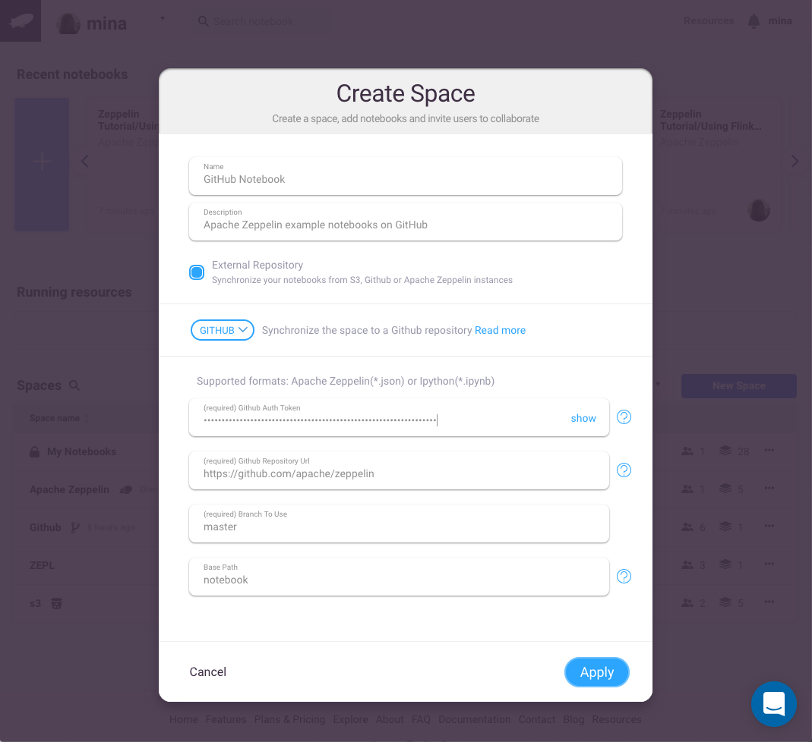
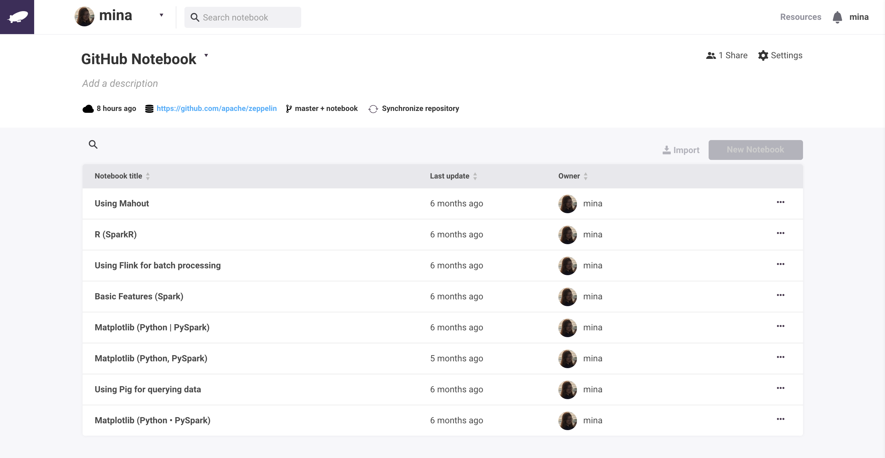

Integration with Github

In this section, we will explain how you can create a Github Space and synchronize your Github notebook.

# Create a space
Click on **New** on the navbar dropdown and click on **Space**.

A popup will open. The first step is to choose the **type** of your space. In our case we will choose **Github**.

# Github Space form

The first step is to **write a fancy name** to your Github space. for example: My github space.

## Requirement for connecting a Github space

In order to connect to your Github repository, **Zepl** needs a **Github personal access tokens**.

Go to [github settings](https://github.com/settings/tokens) and follow the [github documentation](https://help.github.com/articles/creating-a-personal-access-token-for-the-command-line/)

the **Repo scope** needed for Zepl is **repo** like the picture below.

## Fill the Github Space form

- Github Auth Token: **Paste** the Github access token that you generated in the previous section.

- Github Url: Is the **url of your Github repository**. In our example we will take: [apache zeppelin github repository](https://github.com/apache/zeppelin).

- Branch name: By default zepl is using **master**.

- (Optional field) Folder to search notebooks: is the directory where your notebook are. In our example,[apache zeppelin github repository](https://github.com/apache/zeppelin) the notebooks are inside the **notebook folder**. So we will set it to **notebook**.

The form should be similar as the picture bellow:

You can now click on **Apply** to create your Github space. You will be redirected to the new created space. The space will synchronize automatically your notebook, and they will be display inside your space.

You can also **trigger manually** the synchronization of your Github space or it will be done automatically every 10 min.

You can know enjoy the power of **Zepl** with your notebook store in **Github**.
