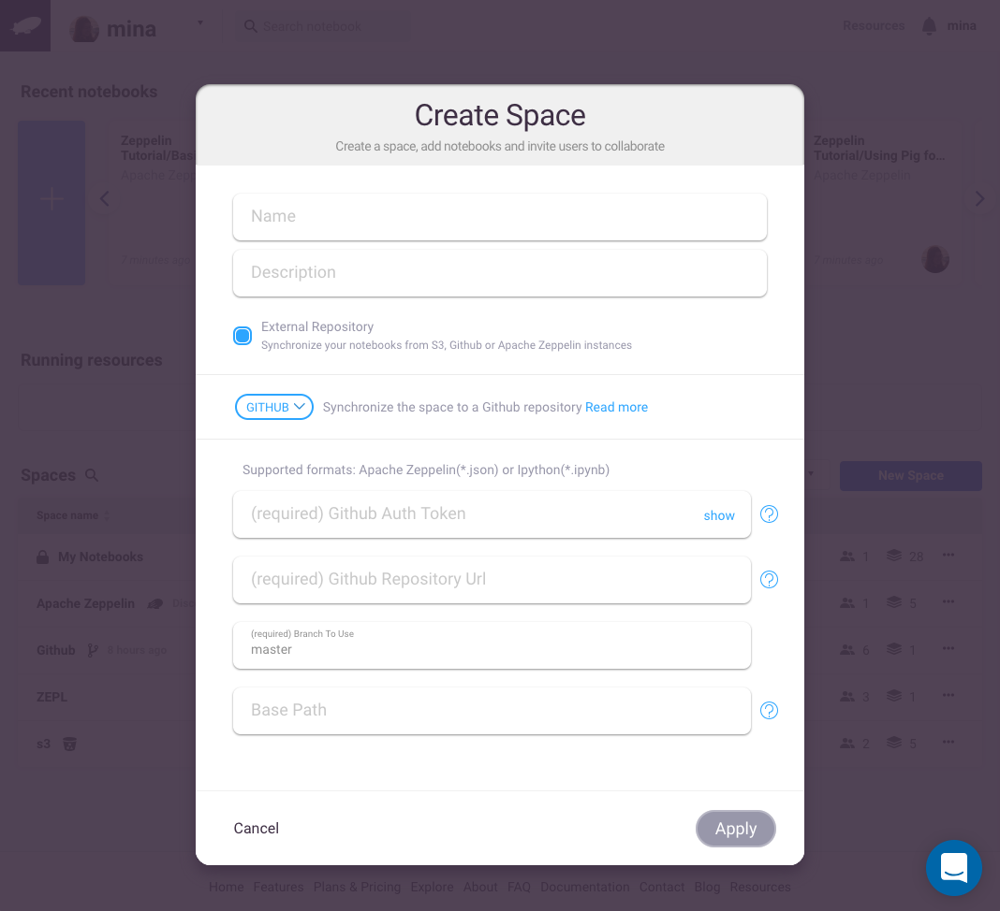
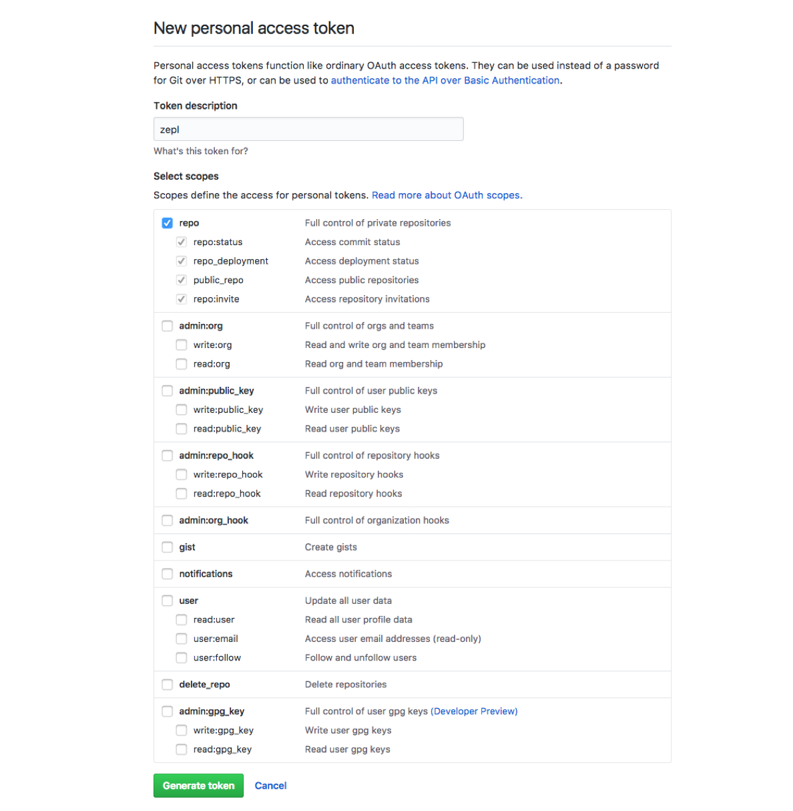

Integration with Github

In this section, we will explain how you can create a Github Space and synchronize your Github notebook.

# Create a space
Click on **New** on the navbar dropdown and click on **Space**.

A popup will open. The first step is to choose the **type** of your space. In our case we will choose **Github**

# Github Space form

The first step is to **write a fancy name** to your Github space. for example: My github space.

## Generate a Github token for zepl.

In order to connect to your Github repository, **Zepl** needs a **Github personal access tokens**.

Go to [github settings](https://github.com/settings/tokens)   

Or from [github](https://github.com), click on **settings** in the dropdown menu and then click on **Personal access tokens** on the bottom left Developer settings menu

You should be now in this page

Click on **generate** new token. Then Add a name to your token: for example: zepl and **select Repo scope** and then click on **generate token** like the picture below.

You just need to **copy** the token generated.

## Fill the Github Space form

- Github Auth Token: **Paste** the Github access token that you generated in the previous section.

- Github Url: Is the **url of your Github repository**. In our example we will take: [apache zeppelin github repository](https://github.com/apache/zeppelin)

- Branch name: By default zepl is using **master**

- (Optional field) Folder to search notebooks: is the directory were your notebook are. In our example,[apache zeppelin github repository](https://github.com/apache/zeppelin) the notebook are inside the notebook folder. So we will set it to **notebook**.

The form should be similar as the picture bellow:

You can now click on **Apply** to create your Github space. and you will be redirected to the new created space. The synchronization will be automatic and your notebook found will be shown.

You can also **trigger manually** the synchronization of your Github space or it will be done automatically every 10 min.
