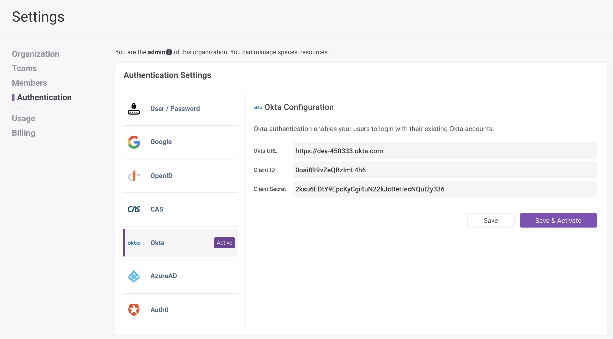
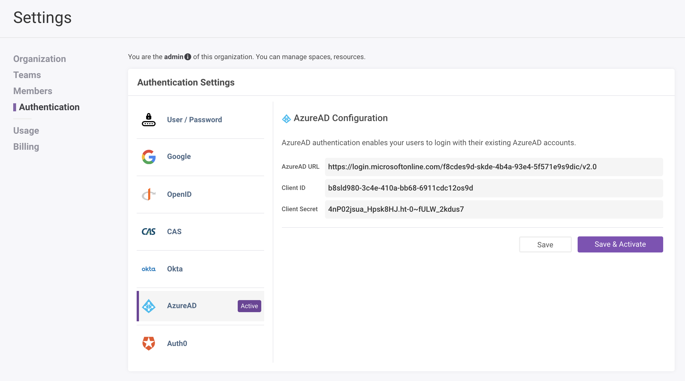

# Configure an authentication provider in Zepl
[Username / Password](#user-pass)

[Google](#google)

[OpenID Connect](#openid-connect)
* [Okta](#openid-connect-okta)
* [Azure AD](#openid-connect-azure-ad)
* [Auth0](#openid-connect-auth0)

> The OpenID Connect protocol is supported by most SSO providers. If you don't see the name of your provider on this page, please check your provider's documentation.

[CAS](#cas)
 
 

# Username / Password 
This is the default authentication method for Zepl and will be enabled upon sign up. This gives each user the ability to create a Zepl username and password for authentication.

# Google 
Enable your users to authenticate with their existing Google accounts. There are only two fields required for this configuration in Zepl: `Client ID` and `Client Secret`.

### [Google's Developer Portal](https://console.developers.google.com/)
#### Setup OAuth Consent:
1. Select OAuth consent screen 
2. Select Application Type 
    * Internal: Only users with a Google Account in your organization can grant access to the scopes requested by this app
    * External: Your app will be available to any user with Google Account
3. Create
4. Application Name: Zepl
5. Application logo (right click image to save as): 
6. Authorized domains: Your Company Domain 
    * Example: `zepl.com`
7. Save

#### Setup OAuth 2.0 Client ID and Secret:
1. Select Credentials > Create Project
2. Select "+ Create Credentials" > OAuth client ID
3. Application type: Web application
4. Name: Zepl
5. Authorized JavaScript origins: Nothing required
6. Authorized redirect URIs: `https://app.zepl.com/api/v2/authenticator.identity.zepl/callback/googleprovider`
7. Create
8. Copy the `Client ID` and `Client Secret` to use in the next section

### In Zepl's Authentication Settings:
1. Select Settings > Authentication > Google
2. Client ID: Paste the value copied from the previous section
    * Example: `1007962201111-p95t6jaaq720idooa8hq6dpm8qqgwe3s.apps.googleusercontent.com`
3. Client Secret: Paste the value copied from the previous section
    * Example: `GcP61ILeWLk6pveVh8ohQe3t`

# OpenID Connect 
Many of the major SSO providers support authentication through OpenID Connect. In this documentation we will walk through how to use the Generic OpenID Connect authentication method to connect to Okta and Microsoft AD. Zepl is also investing in vendor specific methods to support more granular controls. Following the steps below will work to configure SSO through Okta or Microsoft AD.

Throughout this configuration, keep track of the 3 key fields required in Zepl: `OpenID URL`, `Client ID`, and `Client Secret`. For any generic OpenID Connect configurations (not Okta, AzureAD, or Auth0), set this as the `Redirect URL` in the authentication provider: `https://app.zepl.com/api/v2/authenticator.identity.zepl/callback/openidprovider`

## Okta 
> Note: The email address for a specific user's Zepl account, MUST match the `email` value in that user's Okta account.

### In Okta's Admin Portal:
1. Create an Application: Select the Applications menu > Add Application > Create Application
2. Check the OpenID Connect radio button and select create
3. Enter this value for the login redirect URL: `https://app.zepl.com/api/v2/authenticator.identity.zepl/callback/oktaprovider`
4. Navigate to the general settings for the new application that you created
5. Select `Authorization Code` for Authorized grant types. The final application configuration should look as follows:

  > Note: The "Initiate login URI" can be blank.

6. Add an Application Logo
    * Right click image to save locally, then select : 
    * On the Okta Application screen, select the logo box (with a blank gear icon) > Browse and upload the Zepl logo that you just downloaded.
7. Scroll to the bottom to find the `Client ID` and `Client secret`. Please copy these or keep for reference in the next section

### In Zepl's Authentication Settings:
1. Select Settings > Authentication > OpenID
2. OpenID URL: `https://{Your Okta Account Name}.okta.com`

  >Note: This should NOT contain '-admin' or a trailing slash character (/) at the end of the url. Be sure to include, `https://`.

3. Client ID: Paste from the okta application you created in the previous section. 
    * Example: `4o199js5phG2Cv3204p6`
4. Client Secret: Paste from the okta application you created in the previous section. 
    * Example: `0S-djdCveAac3aGz0CtNBOOwndoHL3I1MWbVv7el`
5. Select Save & Activate
6. Now, logout, log back in, and you should be redirected to Okta

## Azure AD 
### [Azure's Admin Portal](https://portal.azure.com/):
1. Select Azure Active Directory > App Registrations > New Registration
2. Enter this value for the redirect URL: `https://app.zepl.com/api/v2/authenticator.identity.zepl/callback/azureadprovider`

3. Register > Select your new app
4. Copy Application (client) ID below
5. Copy Directory (tenant) ID below

Creating a Client Secret:

1. Select Azure Active Directory > App Registrations > Select the app you just created
2. Select Certificates & secrets > + New client secret
3. Copy the secret value below

> Note: Once you navigate away from this page you can no longer copy this value.

### In Zepl's Authentication Settings:
1. Select Settings > Authentication > OpenID
2. OpenID URL: `https://login.microsoftonline.com/{Your Directory (tenant) ID}/v2.0`. Replace "{Your Directory (tenant) ID}" with the Directory (tenant) ID  from above.

  > Note: This should NOT contain a slash character (/) at the end of the url. Be sure to include, `https://`
  
3. Client ID: Copy the Application (client) ID from the previous section. 
    * Example: `d610128e-9dda-4575-9d2s-b5e75a1e457w`
4. Client Secret: Copy the client secret from the previous section. 
    * Example: `VUq1jKjSsI9HaI1MtaSD3@oZFYfU/I_`
5. Select Save & Activate
6. Now, logout, log back in, and you should be redirected to the Azure authentication page

## Auth0 
### [Auth0 Admin Portal](https://manage.auth0.com/):
1. Select Applications > Create Application
2. Name: "Zepl"
3. Type: "Regular Web Application
4. Select Create

**In the Application screen, navigate to the "Settings" tab:**
1. Please copy the `Domain`, `Client ID`, and `Client Secret` or keep for reference in the next section

2. Set Application Logo: `https://zepl-logo.s3-us-west-1.amazonaws.com/logo_254_256.png`
3. Set the Application Login URI: `https://app.zepl.com/api/v2/authenticator.identity.zepl/callback/auth0provider`
4. Set the Allowed Callback URLs: `https://app.zepl.com/api/v2/authenticator.identity.zepl/callback/auth0provider`
5. Select "Save Changes" at the bottom of the screen

### In Zepl's Authentication Settings:
1. Select Settings > Authentication > Auth0
2. Auth0 URL: `https://{Auth0 Application Domain}/`. 
    * Paste the `Domain` value from the Application you created in the previous section.

  >Note: This MUST contain a trailing slash character (/) at the end of the url. Be sure to include, `https://`.

3. Client ID: Paste from the application you created in the previous section. 
    * Example: `d6KWU7RMqQi6LfTlnm6ZywIQSCOrFZCQ`
4. Client Secret: Paste from the application you created in the previous section. 
    * Example: `axfS4VpeH3ydkjERD9k6JvZTAZm_Bz23pI58JmRP0UrRdPDr351ESsjkBUIs321sE`
5. Select Save & Activate
6. Now, logout, log back in, and you should be redirected to Auth0

# CAS 

> Note: This documentation is coming soon to a Zepl docs page near you!
