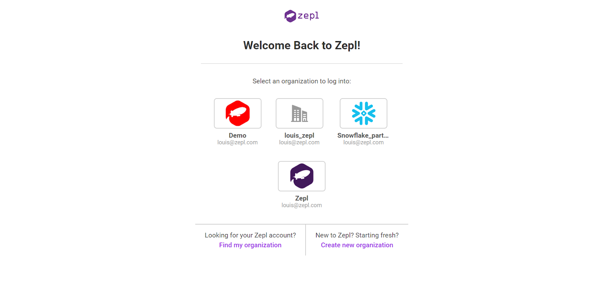

## Sign up for Zepl

To sign up for Zepl, you must go through our registration process to create an organization for your team and a user account for yourself or be invited to join a teammate’s organization.

To start the registration process and create your own organization and user account, visit [www.zepl.com/register](https://www.zepl.com/register).

To join a colleagues organization, they must send you first an invitation from the members section in settings. You will receive an email inviting you to join their organization - click join and go through the account creation process to do so.

You can also sign up for Zepl through Snowflake partner connect. This allows you to connect Snowflake and Zepl with just a few clicks from your existing Snowflake account. See more instructions on how to do that [here](../../partnerships/snowflake_partner_connect/).

## Login Page

Zepl SaaS has a [common login page for you to log into the product](https://www.zepl.com/login). However, you should know that every Zepl organization has a unique login page URL which you can bookmark. Otherwise, Zepl uses browser cookies to keep track of what organizations you have logged into in the past to quickly redirect you to your organization’s login page. There, you simply enter your username and credentials to log in, using the [authentication provider](../../authentication/authentication_providers/) determined by your organization administrator.

Most users are only part of this one organization and will only see one account when they get to the shared login page. Users that are part of more than one organization will see all the organizations they have logged into with their current browser.

## Find My Organizations

If you arrive on the login page and don’t see any organizations to log in to, you may need to find the login page for your organization. The most likely reason for this is that your cookies have recently been deleted, so Zepl doesn’t know what login page to redirect you to.

[You can find your organizations by providing your email at on the _Find My Organizations_ page.](https://www.zepl.com/login/find-your-organization)

## Reset Password

If you have trouble logging in or have forgotten your password, you can reset it on the Forgot Your Password page.
If you still have trouble logging in after resetting your password, please contact Zepl Support.

