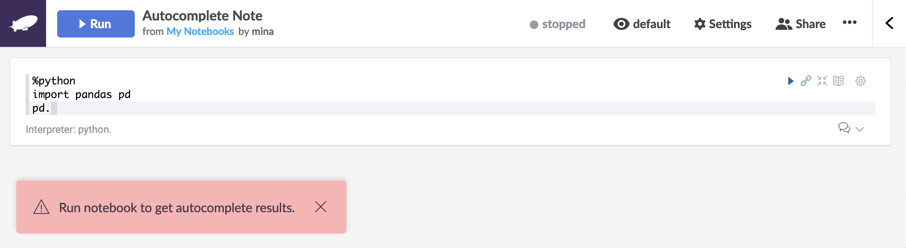

title: Python Autocomplete | SQL Autocomplete | Zepl
description:Zepl supports Spark, SQL, and Python autocompletion. Read this article to learn about using this feature and to view a list of supported interpreter types. 
# Autocompletion in Zepl

## Activating and Using Autocompletion

* autocomplete shortcut: `ctrl + .` or `tab`

Zepl supports spark, SQL, and Python autocompletion.

You'll first need to run a paragraph in the notebook you're working on to activate the feature. Then just use the `ctrl + .` or `tab` hotkey to see possible completions pop up as shown below:

If you forget to run a paragraph in the notebook to activate the feature you'll get a warning like the following:

Notice that the status bar at the top right of the page says *Stopped*. Running a paragraph or the whole notebook will start the container allowing for the use of autocompletion and the status will say *Started*.

## Supported Interpreter Types

Here is the list of interpreters and their specific autocompletion supported features.

#### Spark Interpreter
| Symbol  | Autocompletion Supported | Type |
| --- | --- | --- |
| `%spark`  | supported | SparkInterpreter: provides a Scala environment |
| `%pyspark` | supported | PySparkInterpreter: provides a PySpark environment |
| `%ipyspark`  | supported | IPySparkInterpreter: provides an iPython Spark environment |
| `%dep`  | supported | DepInterpreter: loads dependency libraries into the Spark environment |
| `%sql`  | X | SparkSqlInterpreter - provides a SparkSQL environment |
| `%r`  | X | SparkRInterpreter - provides an R environment |

#### Python Interpreter
| Symbol  | Autocompletion Supported | Type |
| --- | --- | --- |
| `%python`  | supported | PythonInterpreter: provides a Python environment |
| `%ipython` | supported | IPythonInterpreter: provides an iPython environment |
| `%conda`  | X | PythonCondaInterpreter: provides a [Conda](https://conda.io/docs/) environment |
| `%sql`  | X | PythonInterpreterPandasSql: provides a [pandasql](https://pypi.python.org/pypi/pandasql) environment |

#### JDBC Interpreter
| Symbol  | Autocompletion Supported | Type |
| --- | --- | --- |
| `%sql`  | supported | JDBC interpreter with drivers for popular databases |
