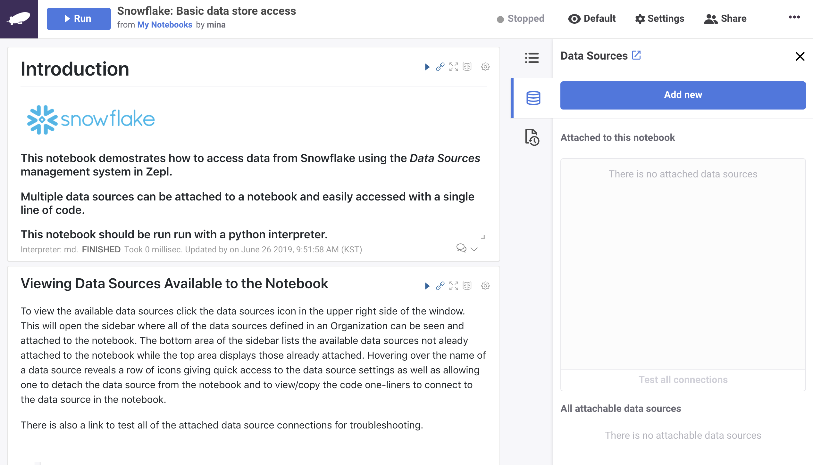

# Data Sources

Zepl Data Sources enable you to securely connect to the database of your choice with your personal credentials. It allows users a secure way to save JDBC connection configurations and to use those configurations in the notebook. Each user is able to add their own credentials to a datasource, making it easy to maintain a library of secure data connections that everyone on the team can use.

### Establishing a Data Source Connection

1. Click the _Data Source_ icon in the upper right side to open the data source panel and click the _Add New_ button.


2. Select a Data Source type. Zepl currently integrates with Snowflake, S3, MySQL, PostgreSQL, Cassandra, and SAP HANA - we are constantly adding more, so let us know if something you were hoping to use is not yet available!


3. Provide a name and a description for your datasource. The name should be unique within your organization since the name will be used as a data source identifier when you reference it in notebooks.


4. Provide connection string information for your datasource so that Zepl can establish a JDBC connection to your Data Source. This connection string information is shared with everyone in your organization. The fields that are required vary for each Data Source integration. <br />


5. Add your personal user credentials to the Data Source. Every user hoping to run a notebook which uses that Data Source must add their own set of user credentials to the Data Source in order to be able to use it - credentials are private for each user and not shared across the organization. The required user credential fields will vary for each integration but are typically username and password. <br />


6. Click “Test Connection” to validate that you can properly connect to the data source. Then, click “Add” to save your Data Source. <br />


7. You have successfully created a Data Source! The datasource will attach to the notebook it was created in. To use the Data Source in any other notebook, simply add the Data Source to the notebook by clicking the “+” arrow next to its name. <br />


### Adding Credentials to An Existing Data Source
Data Sources connections are shared with all members of an organization. However, each user must go through a one-step configuration to securely add their own credentials (or a shared set of credentials)  to the data source. After adding a Data Source to the Notebook, click _Test all connections_ to see if your connection is fully configured. Any data source that has not been properly configured will cause an error and you can add your credentials to it by clicking edit.


### Managing Data Sources
You can manage an Organization's data sources on the _Data Sources_ page in the resources section of the website. Everyone in the organization has access to this page and can add, update or delete data sources.
To use data sources created by other members simply enter your own data source account credentials. The _My credentials_ column in the list indicates whether you have set your credentials or not and neighboring columns indicate how many members have set their own credentials and how many notebooks the data source is attached to.


### Exploring Data from a Data Source

Once you create the Data Source you can explore and interact with it in the notebook via Python, Spark, SQL, or R. The first step is adding the Data Source to a notebook. The Data Source name is then used in a code snippet to establish the connection. Below we use the `Zepl_DS` Data Source as an example.

#### Python Example
```python
%python
import pandas as pd
# establish connection to Snowflake
conn = z.getDatasource('Zepl_DS')

# execute query
res = conn.execute('SELECT * FROM ITEM LIMIT 1000')

# convert datasource into pandas dataframe
df = pd.DataFrame(res)
df.columns = [col[0] for col in conn.description]

# print dataframe as table
z.show(df)
```

#### Spark Example
```scala
%spark
// establish connection to Snowflake and read query result as spark dataframe
val df = z.getDatasource("Zepl_DS")
  .asInstanceOf[org.apache.spark.sql.DataFrameReader]
  .option("query", "SELECT * FROM ITEM LIMIT 100")
  .load()

// print dataframe as table
z.show(df)
```

#### R example
```r
%r
# conn is an DBIConnection object returned by dbConnect() from DPLYR library
conn <- z.getDatasource("Zepl_DS")

# use dbGetQuery() from DPLYR library to run query
apps <- dbGetQuery(conn, "select * from trip_master limit 200")

# z.show() works for the results returned from dbGetQuery()
z.show(apps)
```

#### SQL Example
```sql
%datasource.Zepl_DS
SELECT * FROM ITEM LIMIT 1000
```
