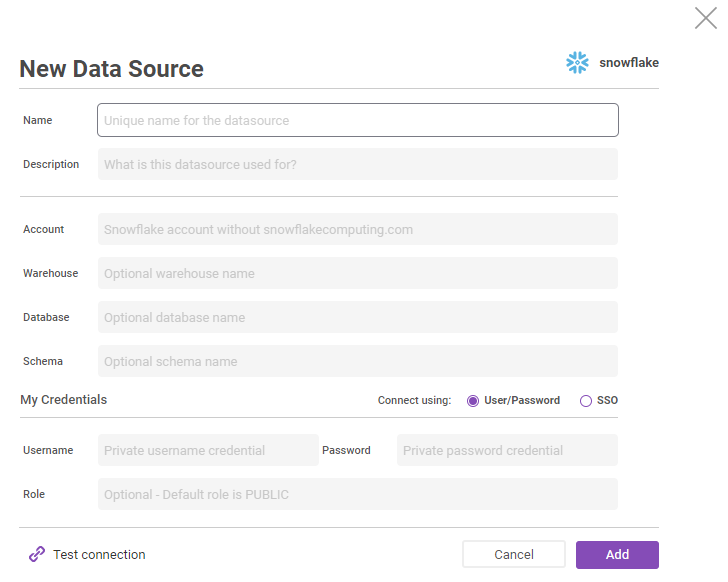
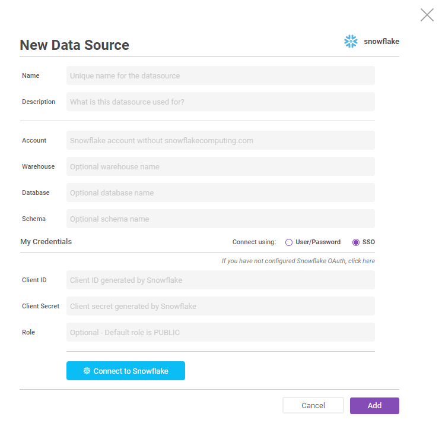
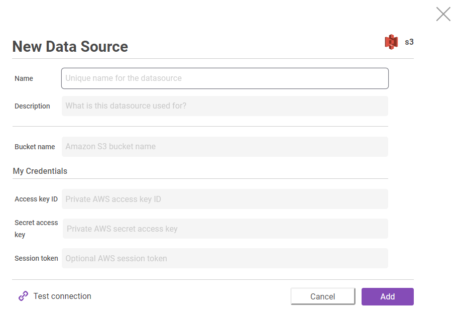
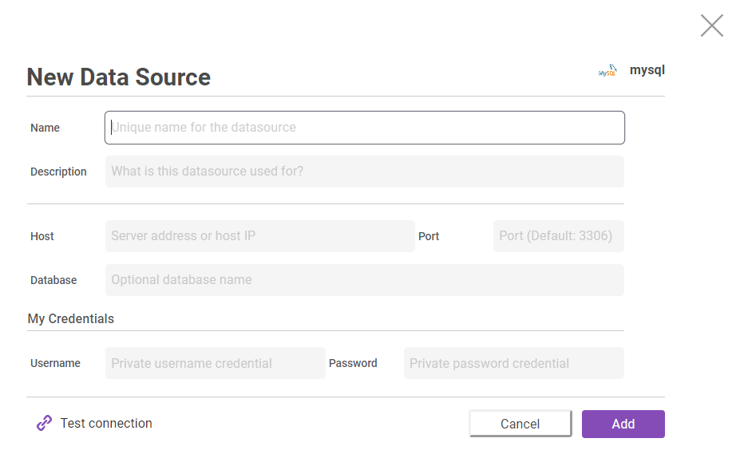
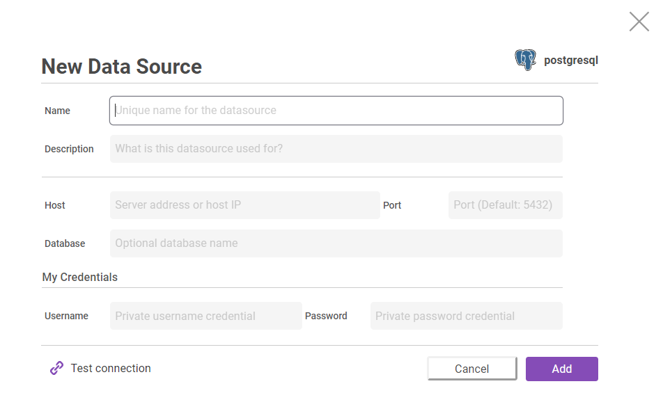
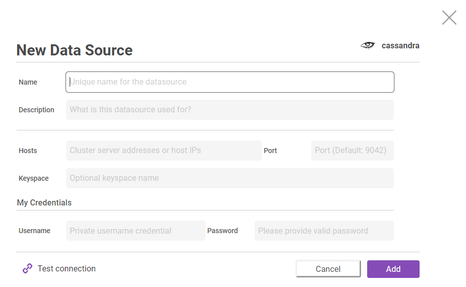
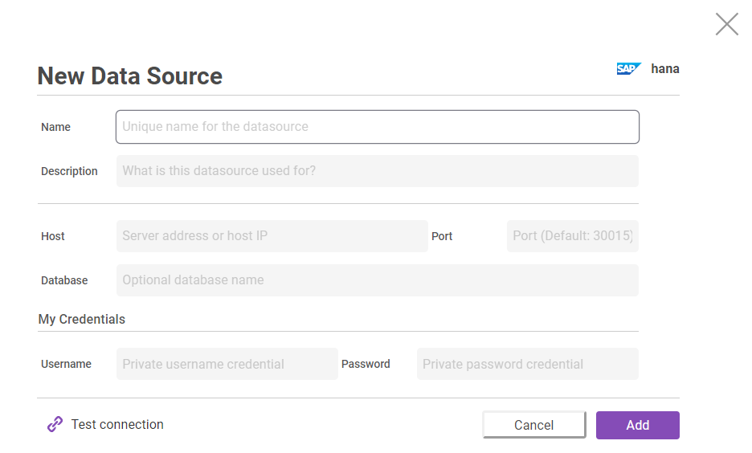

# Data Source Integrations
Zepl currently integrates with Snowflake, S3, MySQL, PostgreSQL, Cassandra, and SAP HANA - we are constantly adding more, so let us know if something you were hoping to use is not yet available!
All Data Source integrations follow the same flow for configuring - you name your Data Source and add a helpful description, you add JDBC connection string information, and you add a set of user-specific personal credentials to allow you to securely establish a connection. Mandatory fields vary slightly for each Data Source integration.

### Snowflake
#### Username & Password
If your Snowflake instance is configured to log in with a Snowflake username and password, use this Data Source configuration option.

Warehouse, Database, and Schema are an optional field to allow a Data Source to be defined a single time for many use cases, but if they are not provided, they must be declared in the SQL statements you send to snowflake.

Role is also an optional field, and can be provided by users to refine their access to objects in Snowflake as defined by the Snowflake account permissions set by your administrator.



#### SSO Authentication
If your Snowflake instance is configured to log in with an external authentication provider, use this Data Source configuration option. Your Snowflake administrator will need to go through [a few steps to extend authentication from Snowflake to Zepl](./#configure-sso-authentication) before you will be able to establish a connection. You can follow the steps here.

Warehouse, Database, and Schema are an optional field to allow a Data Source to be defined a single time for many use cases, but if they are not provided, they must be declared in the SQL statements you send to snowflake.

Once the Snowflake account admin has properly integrated your snowflake instance with your snowflake security, you should be able to use whatever SSO provider your organization has elected to use to connect to your Snowflake instance.

Role is also an optional credential field, and can be provided by users to refine their access to objects in Snowflake as defined by the Snowflake account permissions set by your administrator.  Schema is an optional field but is required for R.



#### Configure SSO Authentication

**Step 1. Create an OAuth integration**

To create an OAuth integration, execute the following [CREATE SECURITY INTEGRATION](https://docs.snowflake.net/manuals/sql-reference/sql/create-security-integration.html) command in Snowflake with an account that has sufficient privilege.

> Only account administrators (users with the ACCOUNTADMIN role) or a role with the global CREATE INTEGRATION privilege can execute this SQL command

```sql
CREATE SECURITY INTEGRATION ZEPL_SSO_INTEGRATION
  TYPE = OAUTH
  ENABLED = TRUE
  OAUTH_CLIENT = CUSTOM
  OAUTH_CLIENT_TYPE = 'CONFIDENTIAL'
  OAUTH_REDIRECT_URI = 'https://www.zepl.com/callbacks/snowflake-datasource-sso'
  OAUTH_ISSUE_REFRESH_TOKENS = TRUE
  OAUTH_REFRESH_TOKEN_VALIDITY = 7776000
```
For more information on customizing the configurations for an OAuth integration, please see [OAuth Custom Client Parameters​](https://docs.snowflake.net/manuals/sql-reference/sql/create-security-integration.html#id2).

Please note that OAuth integration should be specified as following:

* OAUTH_CLIENT_TYPE must be set to `CONFIDENTIAL`. It allows the client (Zepl) to store a secret.
* OAUTH_REDIRECT_URI must be set to `https://www.zepl.com/callbacks/snowflake-datasource-sso`. After a user is authenticated, the web browser is redirected to this URI.
* OAUTH_ISSUE_REFRESH_TOKENS must be set to `TRUE`. It allows the client (Zepl) to exchange a refresh token for an access token when the current access token has expired.
* OAUTH_REFRESH_TOKEN_VALIDITY specifies how long an authentication should be valid (in seconds). The value is default to `7776000` (90 days). After the specified period passed after the authentication, you should re-authenticate in the detail page of the data source to continue the use of the data source.

**Step 2. Create a Snowflake data source**

After integrating OAuth, you can create a Snowflake data source without sharing or storing your login credentials on Zepl.

> You can also authenticate through an external, SAML 2.0-compliant identity provider (IdP) by enabling federated authentication.

> To configure your Snowflake account to use federated authentication, see [Configuring Snowflake to Use Federated Authentication](https://docs.snowflake.net/manuals/user-guide/admin-security-fed-auth-configure-snowflake.html).

1. Execute the [Snowflake function](https://docs.snowflake.net/manuals/sql-reference/functions/system_show_oauth_client_secrets.html) `SELECT SYSTEM$SHOW_OAUTH_CLIENT_SECRETS('ZEPL_SSO_INTEGRATION')` in Snowflake to retrieve the client ID and secret for the integration you’ve created in the previous step and note the client ID and secret for the later step.
Note that the integration name is case-sensitive and must be uppercase and enclosed in single quotes.

2. In the Zepl application, go to the _Data Sources_ page and choose _Snowflake_ in the _Add Data Sources_ section.

3. Enter the unique name for the data source in _Name_ field and account name provided by Snowflake in _Account_ field.

4. In _My Credentials_ section, choose SSO.

5. Click the Connect to Snowflake button. It will open the pop-up with the following title: _Log in to Snowflake to continue to ZEPL_SSO_INTEGRATION._
If it does not open the pop-up, please make sure that your browser is not blocking the pop-up. It will show the error message if the provided account name is invalid or does not match with the client ID.

6. In the pop-up, enter your Snowflake credentials and choose the _Log In_ button. You can also sign in via the IdP if federated authentication is enabled in the provided Snowflake account.
The pop-up will be closed and you will see the message that you are successfully authenticated.

7. Click the Save button. If the provided client secret is invalid or does not match with the client ID, you will see the error message and the data source will not be saved.

**Limitation**

* Expiration of the authentication: The integration uses the refresh token to authenticate with Snowflake. The refresh tokens generated by Snowflake have a limited lifetime up to 90 days due to security reasons. The expiration of the refresh token can be configured by specifying the OAUTH_REFRESH_TOKEN_VALIDITY parameter. Every (up to) 90 days, the user who created the Snowflake data source with SSO should go to the detail page of the Snowflake data source and re-authenticate with a Snowflake account by clicking the _Connect to Snowflake_ button to continue the use of the data source.
> The OAuth integration (client ID and secret) does not have an expiration and a user does not have to re-create the OAuth integration.

* JDBC interpreter is not supported.
* Test connection is not supported.


### Amazon S3


### MySQL


### PostgreSQL


### Cassandra


### SAP Hana

