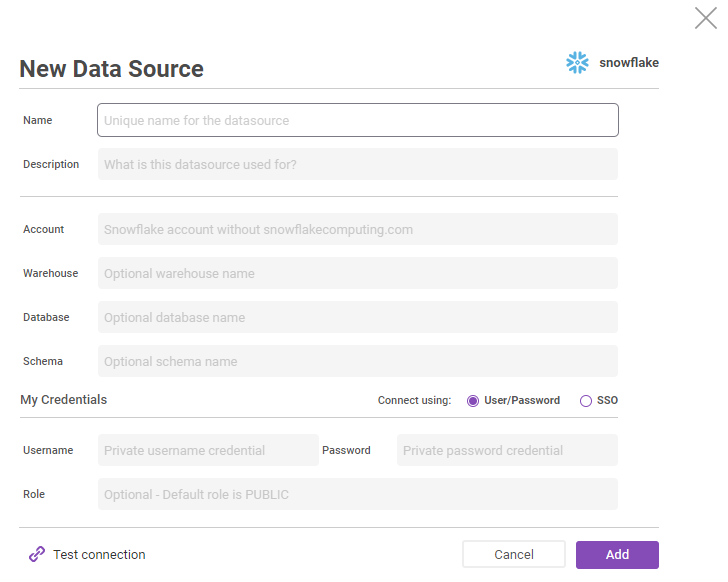

# Snowflake Data Source

Snowflake is a cloud-built data warehouse that delivers instant elasticity and secure data sharing across multiple clouds. Snowflake combines the power of data warehousing, the flexibility of big data platforms and the elasticity of the cloud at a fraction of the cost of traditional solutions.

The Zepl-Snowflake integration provides a unified, cohesive and highly scalable solution to enable data science teams to rapidly explore, analyze, visualize and collaborate around their entire data warehouse.

## Establishing a Snowflake Data Source Connection

1. Click the _Data Source_ icon in the upper right side to open the data source panel and click the _Add New_ button.


2. Set _Type_ to _Snowflake_ and provide a name. The name should be unique within your organization since the name will be used as a data source identifier when you reference it in notebooks. For the purposes of this guide we used `Zepl_Snowflake`.


3. Enter the account name associated with your Snowflake account without the "@snowflakecomputing.com" domain extension. There are 3 other optional fields (_warehouse_, _database_ and _schema_) to further customize the connection to this data source.


4. Enter your Snowflake account user and password credentials and click the _Create_ button. The Snowflake source will be auto-attached to the notebook so that you can use the data source within the notebook. You can detach the data source if you are not going to use it in the notebook. By having the attach/detach mechanism, the notebook execution container doesn't need to keep unnecessary connections to data sources. The data source created here is available to all members in the organization and can be used in other notebooks. Each user must provide their own credentials to use the data source in their own notebooks.


1. To verify that the Snowflake configuration is valid, click the _Test all connections_ link. A green checkmark icon will be shown if it succeeds. Otherwise a warning icon will be shown with a message describing the cause of failure. <br />


### Exploring Data from a Snowflake Data Source

Once you create the data source you can explore and interact with it via Python, Spark or SQL. The data source name is used in a code snippet to establish the connection. Below we use the `Zepl_Snowflake` data source as an example.

#### Python Example
```python
%python
import pandas as pd
# establish connection to Snowflake
conn = z.getDatasource('Zepl_Snowflake')

# execute query
res = conn.execute('SELECT * FROM ITEM LIMIT 1000')

# convert datasource into pandas dataframe
df = pd.DataFrame(res)
df.columns = [col[0] for col in conn.description]

# print dataframe as table
z.show(df)
```

#### Spark Example
```scala
%spark
// establish connection to Snowflake and read query result as spark dataframe
val df = z.getDatasource("Zepl_Snowflake")
  .asInstanceOf[org.apache.spark.sql.DataFrameReader]
  .option("query", "SELECT * FROM ITEM LIMIT 100")
  .load()

// print dataframe as table
z.show(df)
```

#### SQL Example
```sql
%datasource.Zepl_Snowflake
SELECT * FROM ITEM LIMIT 1000
```

### Managing Data Sources
You can manage an Organization's data sources on the _Data Sources_ page.
Everyone in the organization has access to this page and can add, update or delete data sources. To use data sources created by other members simply enter your own data source account credentials. The _My credentials_ column in the list indicates whether you have set your credentials or not and neighboring columns indicate how many members have set their own credentials and how many notebooks the data source is attached to.

