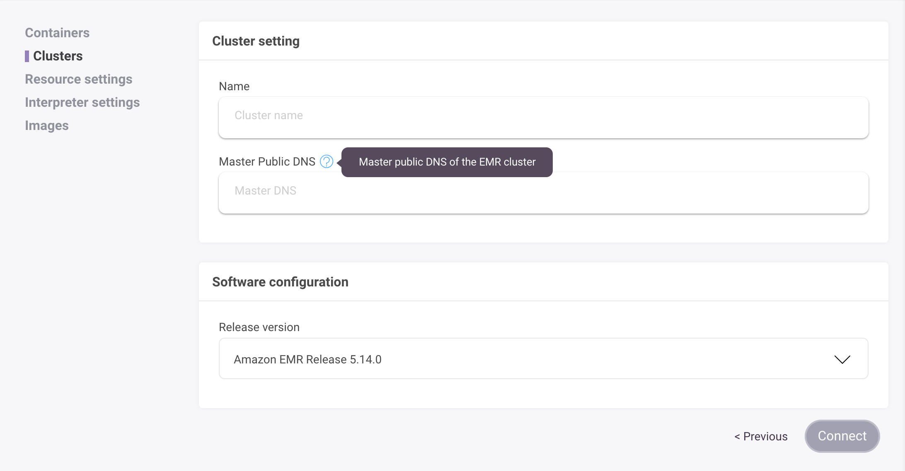

# Integration with Amazon EMR

[Amazon EMR](https://aws.amazon.com/emr/) is a managed cluster platform that simplifies running big data frameworks such as Apache Hadoop and Apache Spark on AWS to process and analyze vast amounts of data.

> Important: This article applies to the [enterprise plan](https://www.Zepl.com/plans-and-pricing/) (with AWS Cloud) only. Please [contact us](mailto:sales@Zepl.com) for more information.

There are two options when connecting Zepl to AWS EMR clusters.

> Note: In both cases, the EMR cluster will have to reside on the same VPC as Zepl.

### Option 1: Existing AWS EMR Clusters

Zepl can connect to existing EMR clusters that your team has created through the AWS console. There are two requirements:

* the EMR cluster and the Zepl deployment must be on the same VPC
* the EMR cluster must have a public, resolvable domain name

To connect a Zepl notebook to an existing EMR cluster:

1. Go to the *Resources* page on Zepl and click on the *Clusters* item
2. On the *Clusters* page, click on *New Cluster*
3. Select the *Connect to an externally managed EMR cluster* and click *Next*

4. Give the cluster a name and add the *Master public DNS* of the EMR cluster in the respective fields

5. Once it's connected you can go to any notebook and select the cluster you just created in the *Notebook Settings* window

> Note: Currently Zepl only supports EMR Release v5.14.0 (more will be added in the future)

### Option 2. Create a new EMR Cluster

Zepl also enables you to create a new EMR cluster through the Zepl interface.

> Note: It is assumed that in the process of the Zepl deployment, the Zepl user IAM role has the credentials to create EMR clusters.

1. As with the above, go to the *Resources* page and click on the *Clusters* menu

2. On the *Clusters* page click on *Create new Cluster*

3. Select the *Launch new Zepl managed EMR cluster* and click *Next*

4. Give the cluster a name, give it an idle terminate value (shuts down the cluster after the time specified), give it any additional configurations, select the *Hardware configuration* from the dropdown and click *Create*

5. Again, once created, go to any notebook and select the cluster you just created.

> Note: The speed at which the new EMR cluster is created is dependent on AWS. This often take about 5 minutes.

### Managing Clusters

All clusters can be managed from the *Clusters* console.

From here you can disconnect, shutdown, clone and control access to these clusters from your organization members.
