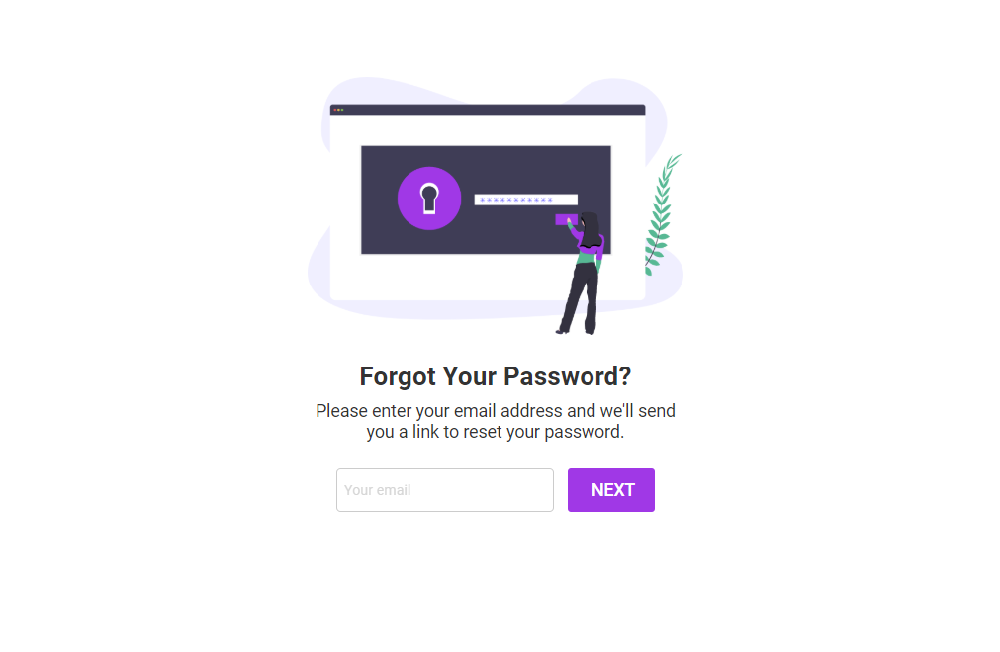

## Sign up for Zepl

To sign up for Zepl, you must go through our registration process to create an organization for your team and a user account for yourself or be invited to join a teammate’s organization.

To start the registration process and create your own organization and user account, visit [www.zepl.com/register](https://www.zepl.com/register).

To join a colleagues organization, they must send you first an invitation from the members section in settings. You will receive an email inviting you to join their organization - click join and go through the account creation process to do so.

You can also sign up for Zepl through Snowflake partner connect. This allows you to connect Snowflake and Zepl with just a few clicks from your existing Snowflake account. See more instructions on how to do that [here](https://docs.zepl.com/guide/enterprise/snowflake_partner_connect/).

## Login page

Zepl SaaS has a [common login page for you to log into the product](https://www.zepl.com/login). However, you should know that every Zepl organization has a unique login page URL which you can bookmark. Otherwise, Zepl uses browser cookies to keep track of what organizations you have logged into in the past to quickly redirect you to your organization’s login page. There, you simply enter your username and credentials to log in, using the authentication provider determined by your organization administrator.

Most users are only part of this one organization and will only see one account when they get to the shared login page. Users that are part of more than one organization will see all the organizations they have logged into with their current browser.

## Find My Organizations

If you arrive on the login page and don’t see any organizations to log in to, you may need to find the login page for your organization. The most likely reason for this is that your cookies have recently been deleted, so Zepl doesn’t know what login page to redirect you to.

[You can find your organizations by providing your email at on the Find My Organizations page.](https://www.zepl.com/login/find-your-organization)

## Reset Password

If you have trouble logging in or have forgotten your password, you can reset it on the Forgot Your Password page.
If you still have trouble logging in after resetting your password, please contact Zepl Support.

# Authentication Providers

In private enterprise environments, Zepl supports multiple login systems that can be set up after deployment into your VPC. This is the list of all the integrations we support but feel free to contact us if you have any questions about an integration or need one not in the list.

## DB

Zepl's default login system. The user will be authenticated against our own database.

#### Registration

- user registers with email address in the Zepl login page
- user receives an email with an authentication link
- user clicks on the link and creates an account (setting username and password)

#### Login

 The user logs in with their username and password on the Zepl login page.

## [Oauth2](https://en.wikipedia.org/wiki/OAuth)

Zepl's alternate default login system (Google integration).

#### Registration / Login

- user clicks on login with Oauth in the Zepl login page
- user will be redirected to the Oauth2 provider
- user logs in on the Oauth2 provider page
- Zepl auth service will create the account/login if Oauth2 transaction succeeds

## [SAML](https://en.wikipedia.org/wiki/SAML_2.0)

Zepl provides integration with SAML 2.0 supporting these standards:
  - assertion and nameId encryption
  - assertion signatures
  - login (SP initiated)
    - IDP login: HTTP-redirect binding only
    - SP login: HTTP-POST binding only

#### Registration / Login

- user will be redirected to your SAML IDP
- user will login on the SML IDP
- Zepl auth service will create the account/login if the SAML transaction succeeds

## [CAS](https://en.wikipedia.org/wiki/Central_Authentication_Service)

Zepl provides an integration with CAS.

#### Registration / Login

- user will be redirected to your CAS login page
- user will login on the CAS provider
- Zepl auth service will create the account/login if the CAS transaction succeeds

## [LDAP](https://fr.wikipedia.org/wiki/Central_Authentication_Service)

Zepl provides an integration with LDAP 3.

#### Registration / Login

- user will input their ldap userID/password in Zepl's login page
- Zepl auth service will verify with ldap that the login information is correct
- Zepl auth service will create the account/login if the authentication succeeds

## [JWT](https://en.wikipedia.org/wiki/JSON_Web_Token)

We are using JWT tokens for our authorization layer in our application and these tokens can be injected into some notebooks for authorization. If your enterprise needs to leverage JWT in order to have access to some of your data layers (that require your enterprise JWT), we can provide a custom login mechanism that can use your enterprise JWT to login into our system. Please contact us for more information.
