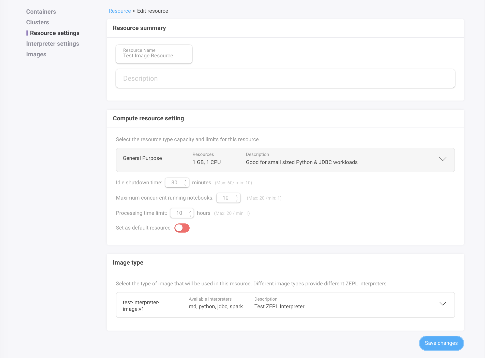

<h1>Custom Image Support</h1>

ZEPL provides a CLI tool to build enterprise users' own custom interpreter images.

## Requirements

Currently, CLI (zcr) **supports OSX and linux 64 bits.** Please contact us if you need support for additional OS.

| Name  | Version | Description  |
|---|---|---|
| Docker | CE 18.06 +  | [Install Docker Community Edition](https://store.docker.com/search?type=edition&offering=community) |
| AWS CLI  | 1.15.31 + |  [Install AWS CLI](https://docs.aws.amazon.com/cli/latest/userguide/installing.html) |

Also you need AWS resources to push the built images into [AWS ECR](https://aws.amazon.com/ecr/)

- [Create AWS key pair](https://docs.aws.amazon.com/IAM/latest/UserGuide/id_credentials_access-keys.html#Using_CreateAccessKey) and export them into the terminal
    ```bash
    export IAM=1ambda AWS_ACCESS_KEY_ID={VALUE} AWS_SECRET_ACCESS_KEY={VALUE}
    ```
- The AWS Key should have the [AWS ECR push permission](https://docs.aws.amazon.com/AmazonECR/latest/userguide/ecr_managed_policies.html).
- [Create AWS ECR](https://docs.aws.amazon.com/AmazonECR/latest/userguide/repository-create.html) in the same region as the deployed ZEPL belongs

```bash
# you can create ECR repository using aws cli too
# https://docs.aws.amazon.com/cli/latest/reference/ecr/create-repository.html
aws create-repository --repository-name {NAME} --region {REGION}
```

<br/>

## Installation

`zcr` can be installed / updated via the commands below.

```bash
curl https://s3-us-west-2.amazonaws.com/io.zepl.asset.public/zcr/dist/install.sh | bash -

# Note that you may need to run the sudo version below, or alternatively chown /usr/local
curl https://s3-us-west-2.amazonaws.com/io.zepl.asset.public/zcr/dist/install.sh | sudo bash -
```

<br/>

Then you can try `zcr` in the terminal. (will be installed under `/usr/local/bin` by default)

```bash
$zcr help

  zcr [command]

Available Commands:
  build       Build ZEPL interpreter docker image from the files generated by `template` command
  create      Create ZEPL interpreter docker image based on the given definition file (.yaml)
  help        Help about any command
  push        Push ZEPL interpreter docker image from the files generated by `build` command
  register    Register the built ZEPL interpreter docker image into the service database
  template    Template ZEPL interpreter Dockerfile based on the given definition file (.yaml)
  version     Print the version information

Flags:
  -d, --dry-run   (optional) If specified, will not push and print JSON output.
  -h, --help      help for zcr

Use "zcr [command] --help" for more information about a command.
```

<br/>

## Usage

- `zcr` helps users to build and register the custom image.
- after then, users would be able to create new notebook with the resource using the custom image (or possible to change resource type in case of exiting notebooks)

### Registration

`zcr` requires a definition file which defines custom packages for interpreters such as R libraries and Pip packages.
With the `zcr create` command, users are able to build / push / register the custom interpreter image.

For the definition file, please refer [the definition section below](./#definition-file-spec).

```bash
# make sure that you exported `AWS_ACCESS_KEY_ID` and `AWS_SECRET_ACCESS_KEY` as env variables.
# replace `{PATH}` with the your own definition file path

$ export TOKEN=$(aws ecr get-login --no-include-email --region us-west-2 | cut -d" " -f6)
$ zic create --definition {PATH} --password ${TOKEN}

# or you can pass the ECR auth token directly

$ zic create --definition ./spark2.definition.yaml \
  --password $(aws ecr get-login --no-include-email --region us-west-2 | cut -d" " -f6)
```

The command will take a few minutes depending on your network speed. If the process is successful, you will see the following messages:

```bash
Successfully built c5c7c63c2bff
Successfully tagged 8XXXXXXXX.dkr.ecr.us-west-2.amazonaws.com/test-interpreter-image:v1

2018-09-03T16:29:41.968+0900    INFO    Successfully built image 8XXXXXXXX.dkr.ecr.us-west-2.amazonaws.com/test-interpreter-image:v1
2018-09-03T16:33:55.688+0900    INFO    Successfully registered test-interpreter-image:v1 into https://XXXX.zepl.com/api/...
```

<br/>

To use the registered interpreter image, Please follow these steps.

1. Create a new resource (or select an existing resource) registered image in ZEPL. (`Resource` -> `Image Type`).
2. Then select the registered image type (the name will be `image.name:image.tag`)
3. Create or update the resource
4. Then select the resource in your notebook.



<br/>

### Definition File Spec

Definition of custom interpreter is written in YAML format. **These fields must be customized and set for each user.**

- `meta.service_domain`: service domain including protocol (e.g. `https://...`)
- `image.repository`: docker image repository (e.g. `0000000000.dkr.ecr.us-west-2.amazonaws.com`)
- `image.name`: docker image name which should match with the ECR repository name (e.g. `custom-image`)
- `image.tag`: docker image tag (e.g. `v1`)
- `image.description`: description for docker image tag which will be displayed in ZEPL UI.

Registered images name would be `image.name:image.tag` in UI.

> WARNING: If the `image.repository:image.name:image:tag` already exists, will overwrite the existing image. Please rename `image.tag` if you want to push a new version.

and users can set system package and interpreter definitions for their preference. Here is an example below. Please check comments on the yaml file.

```yaml
meta:
  service_domain: "https://{DOMAIN}"   # Service Domain

image:
  type: "docker"
  repository: ""                       # Image Repository e.g `0000000000.dkr.ecr.us-west-2.amazonaws.com`
  name: "custom-image"       # Image Name (= ECR repository name)
  tag: "v1"                            # Image Tag
  description: "Test ZEPL Interpreter" # Image Description

system:
  type: "debian"
  packages:
  - name: "git"
    install: "apt-get install -y git"
    verify: "git version"
  - name: "unzip"

interpreter:

  # currently, supports python `2` (2.7.x) and `3` (3.x) verisons only
  python:
    version: "2"
    # remove `python.pip_mirror` if you don't need it
    pip_mirror:
      index_url: "http://ftp.daumkakao.com/pypi/simple"
      trusted_host: "ftp.daumkakao.com"
    packages:
    - name: "matplotlib"
      version: "2.2.2"
    - name: "numpy"
      version: "1.14.3"
    - name: "pandas"
      version: "0.22.0"

  # currently, supports spark `2.1.2`, `2.2.1` and `2.3.0` versins only
  spark:
    version: "2.3.0"
    dependency:
    packages:
    # currently, supports hadoop `2.8.3` verisons only
    - name: "hadoop"
      type: "hadoop"
      version: "2.8.3"

  # currently, supports R `3.4` and `3.5` verisons only
  r:
    version: "3.5"
    # remove `r.cran_mirror` if you don't need it
    cran_mirror: "https://ftp.harukasan.org/CRAN"
    packages:
    - name: "ggplot2"
    - name: "knitr"
    - name: "devtools::install_github('rasmusab/bayesian_first_aid')"
      type: "devtools"

  jdbc:
    repository:
      # define additional / private maven repositories (`mavenLocal`, `mavenCentral` are used by default)
      maven:
      - url: "http://redshift-maven-repository.s3-website-us-east-1.amazonaws.com/release"

    packages:
    # download athena JDBC jar from URL directly
    - name: "athena"
      version: "com.amazonaws.athena.jdbc:AthenaJDBC41:2.0.5"
      type: "maven:url"
      url: "https://s3.amazonaws.com/athena-downloads/drivers/JDBC/SimbaAthenaJDBC_2.0.5/AthenaJDBC41_2.0.5.jar"

    # download mysql JDBC jar from maven repositories
    - name: "mysql"
      version: "mysql:mysql-connector-java:5.1.46"
    - name: "postgresql"
      version: "org.postgresql:postgresql:42.2.2"
    - name: "redshift"
      version: "com.amazon.redshift:redshift-jdbc41:1.2.15.1025"
```

## Trouble Shooting

`zcr`'s `create` command is the combination of these commands. So can execute separately.

- `template`: generates templates based on the given definition file
- `build`: builds docker image from the Dockerfile generated by the `template` command
- `push`: pushes the built docker image into docker repository (ECR)
- `register` registers the pushed docker image into the ZEPL database

For required parameters, Please check `zcr help`. (e.g `zcr template --help`)

<br/>

### Verifying installed interpreters

To test whether packages or libraries are installed correctly, you can use these command in notebook paragraphs. (**Make sure you are using the image you want to test**)

<br/>

#### **Testing Spark Version**

```scala
%spark

println(sc.version)
```

#### **Testing R Version**

```
%python

!R --versioa
```

#### **Testing Python Version**

```python
%python

import sys
print(sys.version)
```

#### **Testing Installed JDBC Jars**

```
%python

!ls -al /usr/zepl/interpreter/lib | grep mysql
!ls -al /usr/zepl/interpreter/lib | grep athena
```


