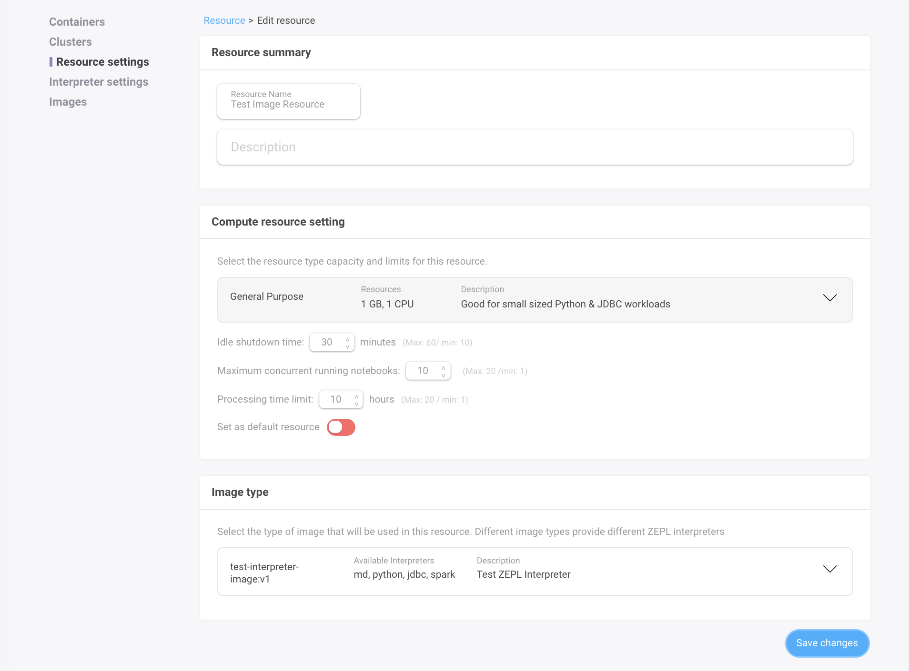

### Requirements

Currently the `zcr` supports macOS and 64-bit Linux. Please contact us if you need support for additional operating systems.

| Name  | Version | Description  |
|---|---|---|
| Docker | CE 18.06 +  | [Install Docker Community Edition](https://store.docker.com/search?type=edition&offering=community) |
| AWS CLI  | 1.15.31 + |  [Install AWS CLI](https://docs.aws.amazon.com/cli/latest/userguide/installing.html) |

You'll also need AWS resources to push the built images to [AWS ECR](https://aws.amazon.com/ecr/):

- [create the AWS key pair](https://docs.aws.amazon.com/IAM/latest/UserGuide/id_credentials_access-keys.html#Using_CreateAccessKey) and export it to the terminal
    ```bash
    export IAM=1ambda AWS_ACCESS_KEY_ID={VALUE} AWS_SECRET_ACCESS_KEY={VALUE}
    ```
- the AWS keys should have [AWS ECR push permissions](https://docs.aws.amazon.com/AmazonECR/latest/userguide/ecr_managed_policies.html)
- [create the AWS ECR](https://docs.aws.amazon.com/AmazonECR/latest/userguide/repository-create.html) in the same region as the Zepl deployment

```bash
# you can create an ECR repository using the AWS cli as well
# https://docs.aws.amazon.com/cli/latest/reference/ecr/create-repository.html
aws create-repository --repository-name {NAME} --region {REGION}
```

### Installation

`zcr` can be installed/updated via the commands below:

```bash
curl https://s3-us-west-2.amazonaws.com/io.zepl.asset.public/zcr/dist/install.sh | bash -

# note that you may need to run the sudo version below, or alternatively chown /usr/local
curl https://s3-us-west-2.amazonaws.com/io.zepl.asset.public/zcr/dist/install.sh | sudo bash -
```

`zcr` will be installed in `/usr/local/bin` by default and you should now be able to run it in the terminal as follows:

```bash
$zcr help

  zcr [command]

Available Commands:
  build       Build Zepl interpreter docker image from the files generated by `template` command
  create      Create Zepl interpreter docker image based on the given definition file (.yaml)
  help        Help about any command
  push        Push Zepl interpreter docker image from the files generated by `build` command
  register    Register the built Zepl interpreter docker image into the service database
  template    Template Zepl interpreter Dockerfile based on the given definition file (.yaml)
  version     Print the version information

Flags:
  -d, --dry-run   (optional) If specified, will not push and print JSON output.
  -h, --help      help for zcr

Use "zcr [command] --help" for more information about a command.
```

#### Registration

`zcr` requires a definition file which defines custom packages for interpreters such as R libraries and Pip packages. With the `zcr create` command users are able to build/push/register custom interpreter images.

For an explanation of the definition file, please refer to the [definition section below](../custom_image_support/#definition-file-spec).

```bash
# make sure that you exported `AWS_ACCESS_KEY_ID` and `AWS_SECRET_ACCESS_KEY` as env variables
# replace `{PATH}` with the file path to your definition file

$ export TOKEN=$(aws ecr get-login --no-include-email --region us-west-2 | cut -d" " -f6)
$ zcr create --definition {PATH} --password ${TOKEN}

# or you can pass the ECR auth token directly

$ zcr create --definition ./spark2.definition.yaml \
  --password $(aws ecr get-login --no-include-email --region us-west-2 | cut -d" " -f6)
```

The command will take a few minutes to run depending on your network speed. If the process is successful you will see the following messages:

```bash
Successfully built c5c7c63c2bff
Successfully tagged 8XXXXXXXX.dkr.ecr.us-west-2.amazonaws.com/test-interpreter-image:v1

2018-09-03T16:29:41.968+0900    INFO    Successfully built image 8XXXXXXXX.dkr.ecr.us-west-2.amazonaws.com/test-interpreter-image:v1
2018-09-03T16:33:55.688+0900    INFO    Successfully registered test-interpreter-image:v1 into https://XXXX.zepl.com/api/...
```

Please follow the steps below to use the registered interpreter image:

1. Create a new resource image (or select an existing one) from the *Image Type* area at the bottom of the resource definition page
2. Select the registered image type (the name will be `image.name:image.tag`)
3. Create or update the resource
4. Select the resource in your notebook settings



#### Definition File Spec

Custom interpreter definition files are written in YAML format. The following fields must be set for each user:

- `meta.service_domain`: service domain including protocol (e.g. `https://...`)
- `image.repository`: docker image repository (e.g. `0000000000.dkr.ecr.us-west-2.amazonaws.com`)
- `image.name`: docker image name which should match the ECR repository name (e.g. `custom-image`)
- `image.tag`: docker image tag (e.g. `v1`)
- `image.description`: description for docker image tag which will be displayed in the Zepl UI

Registered image names appear as `image.name:image.tag` in the UI.
 
> WARNING: If the `image.repository:image.name:image:tag` image already exists it will be overwritten when pushing a new version. If you'd like this to appear as a separate image please modify the `image.tag` component of the concatenated image name.

Below is an example definition file with 
system package and interpreter definition field sections settable by the user. Please refer to the comments for help:

```yaml
meta:
  service_domain: "https://{DOMAIN}"   # Service Domain

image:
  type: "docker"
  repository: ""                       # Image Repository e.g `0000000000.dkr.ecr.us-west-2.amazonaws.com`
  name: "custom-image"       # Image Name (= ECR repository name)
  tag: "v1"                            # Image Tag
  description: "Test Zepl Interpreter" # Image Description

system:
  type: "debian"
  packages:
  - name: "git"
    install: "apt-get install -y git"
    verify: "git version"
  - name: "unzip"

interpreter:

  # currently only supports Python versions 2.7.x and 3.x
  python:
    version: "2"
    # remove `python.pip_mirror` if you don't need it
    pip_mirror:
      index_url: "http://ftp.daumkakao.com/pypi/simple"
      trusted_host: "ftp.daumkakao.com"
    packages:
    - name: "matplotlib"
      version: "2.2.2"
    - name: "numpy"
      version: "1.14.3"
    - name: "pandas"
      version: "0.22.0"

  # currently only supports spark versions `2.1.2`, `2.2.1` and `2.3.0`
  spark:
    version: "2.3.0"
    dependency:
    packages:
    # currently only supports hadoop version `2.8.3`
    - name: "hadoop"
      type: "hadoop"
      version: "2.8.3"

  # currently only supports R verisons `3.3`, `3.4` and `3.5`
  r:
    version: "3.5"
    # remove `r.cran_mirror` if you don't need it
    cran_mirror: "https://ftp.harukasan.org/CRAN"
    packages:
    - name: "knitr"    # `knitr` is required for Zepl's %spark.r
    - name: "ggplot2"
    - name: "devtools::install_github('rasmusab/bayesian_first_aid')"
      type: "devtools"

  jdbc:
    repository:
      # define additional/private maven repositories (`mavenLocal` and `mavenCentral` are used by default)
      maven:
      - url: "http://redshift-maven-repository.s3-website-us-east-1.amazonaws.com/release"

    packages:
    # download athena JDBC jar from URL directly
    - name: "athena"
      version: "com.amazonaws.athena.jdbc:AthenaJDBC41:2.0.5"
      type: "maven:url"
      url: "https://s3.amazonaws.com/athena-downloads/drivers/JDBC/SimbaAthenaJDBC_2.0.5/AthenaJDBC41_2.0.5.jar"

    # download mysql JDBC jar from maven repositories
    - name: "mysql"
      version: "mysql:mysql-connector-java:5.1.46"
    - name: "postgresql"
      version: "org.postgresql:postgresql:42.2.2"
    - name: "redshift"
      version: "com.amazon.redshift:redshift-jdbc41:1.2.15.1025"
```

### Trouble Shooting

`zcr`'s *create* command is a combination of the following commands, each of which can execute separately:

- `template`: generates templates based on the given definition file
- `build`: builds docker images from the Dockerfile generated by the `template` command
- `push`: pushes the built docker image into the docker repository (ECR)
- `register`: registers the pushed docker image into the Zepl database

For required parameters please run `zcr help` (e.g `zcr template --help`).

#### Verifying Installed Interpreters

To test whether libraries/packages are installed correctly in your custom image, you can use the following commands in notebook paragraphs for the respective interpreters.

>Note: make sure the custom image is attached to the notebook.

#### Testing Spark and Hadoop Versions

```scala
%spark

println(sc.version)
```

```
%python

!ls -al /usr/ZEPL | grep hadoop
```

#### Testing R Version and Libraries

```
%python

!R --version
```

```
%spark.r

library(ggplot2)
```

#### Testing Python Version and Packages

```python
%python

import sys
print(sys.version)
```

```python
import pandas
```

#### Testing Installed JDBC Jars

```
%python

!ls -al /usr/ZEPL/interpreter/lib | grep mysql
!ls -al /usr/ZEPL/interpreter/lib | grep athena
```
