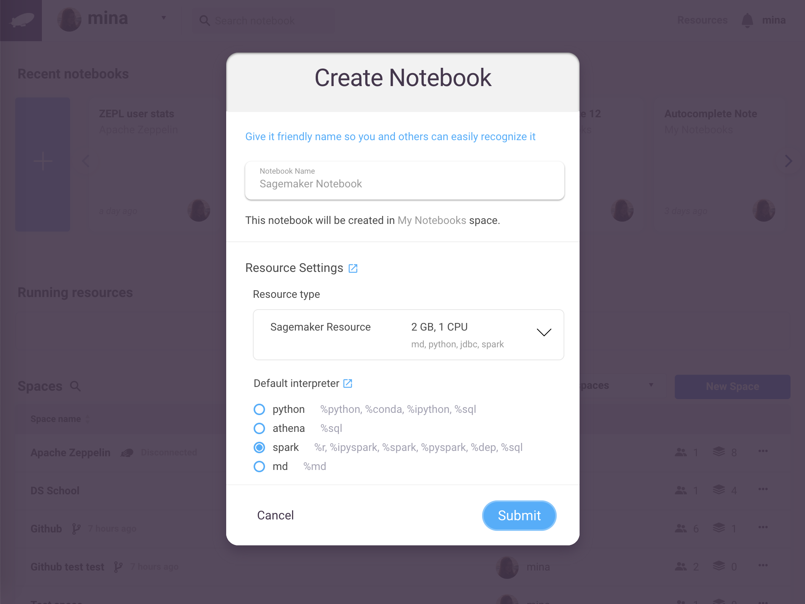

# Integration with Amazon Sagemaker

Amazon [*Sagemaker*](https://aws.amazon.com/sagemaker/) is a fully managed service for handling machine learning workflows. It enables users to build, train, and deploy ML models quickly. But before you can deploy your ML model, it must first be built, tuned, and iterated. Notebooks, and more specifically Zepl notebooks, are perfectly suited for these tasks.

Now you can use Zepl to connect directly to *Sagemaker* in your VPC by simply selecting the *Sagemaker* resource available in Zepl.

Simply create a new notebook and select *Sagemaker* in the resource drop down:



You can also switch an existing notebook's resource to *Sagemaker* by clicking the *Settings* link in the top right of the notebook.

That's it! Nothing else to install. You can then do the following in the notebook:

```python
%python
from sagemaker.session import Session
from sagemaker import KMeans
import boto3

import pickle, gzip, numpy, urllib.request
import matplotlib.pyplot as plt

AWS_ACCESS_KEY_ID="[your_AWS_KEY_ID]"
AWS_SECRET_ACCESS_KEY="[your_AWS_SECRET_KEY]"
REGION_NAME = "[region_of_your_VPC]"

def get_boto3_session_with_credentials():
    return boto3.Session(aws_access_key_id=AWS_ACCESS_KEY_ID, aws_secret_access_key=AWS_SECRET_ACCESS_KEY,region_name=REGION_NAME)

role = "[your_ARN_ROLE]"
session = Session(get_boto3_session_with_credentials())
bucket = session.default_bucket()

# your code goes below
```

As long as you have your AWS credentials setup correctly your model would be deployed to the *Sagemaker* service in your VPC. In addition, the Zepl *Sagemaker* resource image is already pre-loaded with the following Python libraries allowing you and your team to leverage *Sagemaker* for all of your machine learning needs:

* boto3
* matplotlib
* numpy
* pandas
* pandasql
* Pillow
* scipy
* scikit-learn
* tensorflow
* bkzep
* statsmodels
* seaborn
* plotly
* bokeh
* pydot
* keras
* nltk
* gensim
* scrapy
* requests
* sagemaker

You can also create custom images for your organization using our [Custom Image Support](../enterprise/custom_image_support) feature. And as always, if you have any questions please don't hesitate to [contact us](mailto:support@zepl.com).
