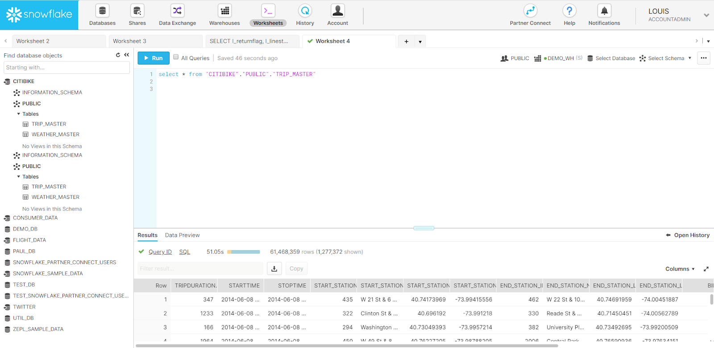
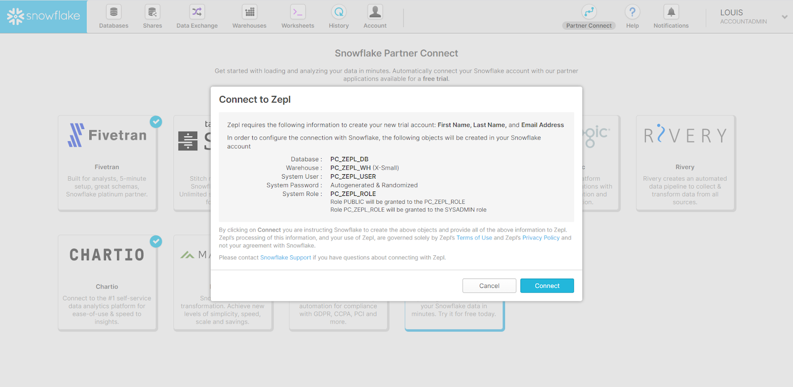
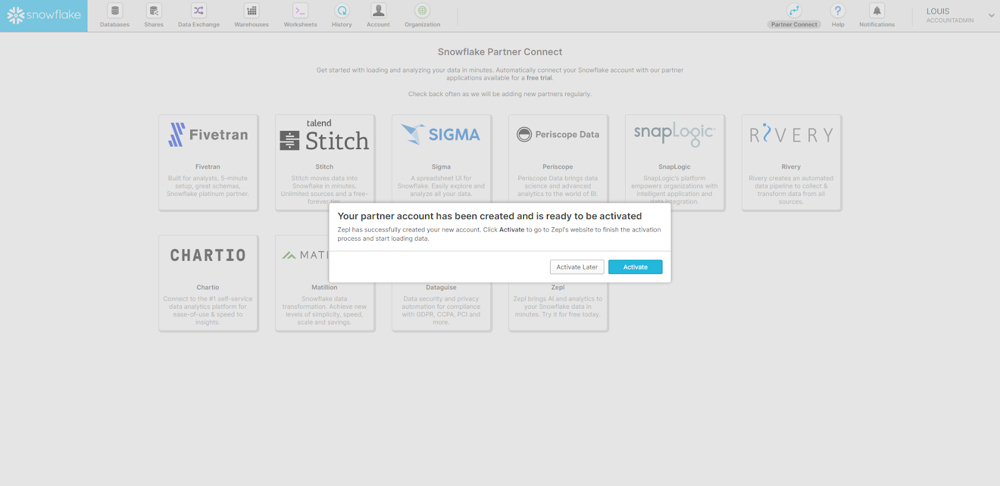
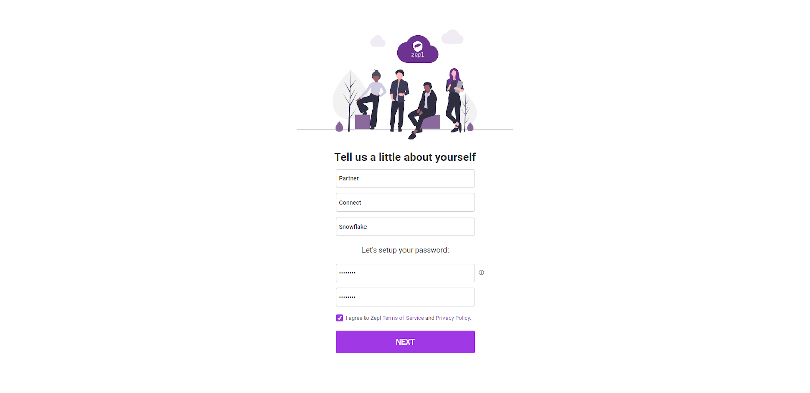

# Snowflake Partner Connect

Zepl is proud to participate in Snowflake Partner Connect. This program allows Snowflake users to quickly create a Zepl trial & connect Zepl to your Snowflake account. Here’s how you can get started using Zepl with Partner Connect:

**Step 1**

Log in to your Snowflake account as an Account Admin.

**Step 2**

Select the Partner Connect tile from the top right.

**Step 3**

Click the Zepl tile, followed by Connect. Snowflake will auto-create an extra-small data warehouse (`PC_ZEPL_WH`) and a database (`PC_ZEPL_DATABASE`) for you to pipe data into for use in Zepl.

**Step 4**

Once the account has been created, a pop-up will appear confirming that the Snowflake <> Zepl connection is ready to be activated. Click Activate to continue with the process.

**Step 5**

You can now choose between creating a new Zepl account / organization or connecting your Snowflake environment to an existing Zepl organization. To create your account, enter your email and click Next.

**Step 6**

After answering a few questions to create a new account account, you will begin a 30 day free trial with $400 worth of Zepl credit to run analytics.

**Step 7**

Log in to Zepl. Upon landing in the product, you will be shown how to run your first notebook via a guided tour.

