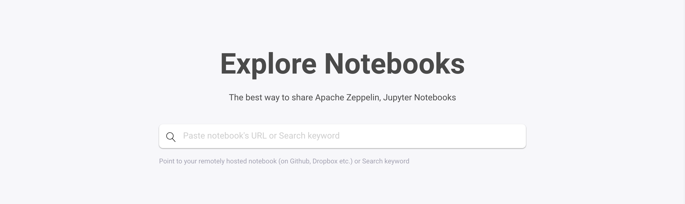
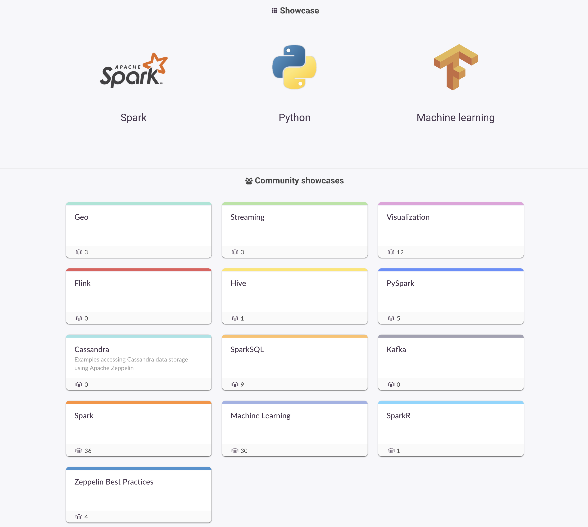
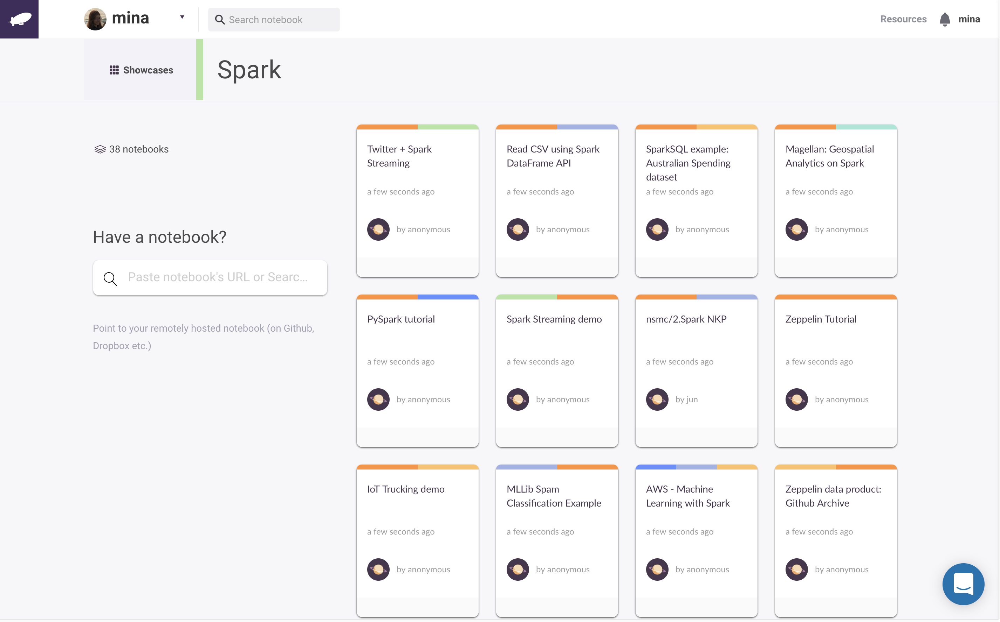

title: Share Jupyter Notebooks | Exploring Zepl Public Notebooks
description: Zepl Explore provides a communal space for anyone to share their Zepl notebooks with the world. Learn more about sharing Jupyter and Zeppelin notebooks.
# Exploring Public Notebooks

[Zepl Explore](https://app.zepl.com/explore) provides a communal space for anyone to share their Zepl notebooks with the world. Show off what you've done with Zepl and see what others have accomplished. You can both add any published notebook using it's publish URL or search for notebooks with keywords in the text field near the top of the page. Contribute and come back often to see what's new!

> Note: Anyone can view the notebooks, even non-Zepl users.

# Showcases?

Zepl has a number of showcases available to categorize submitted notebooks.

