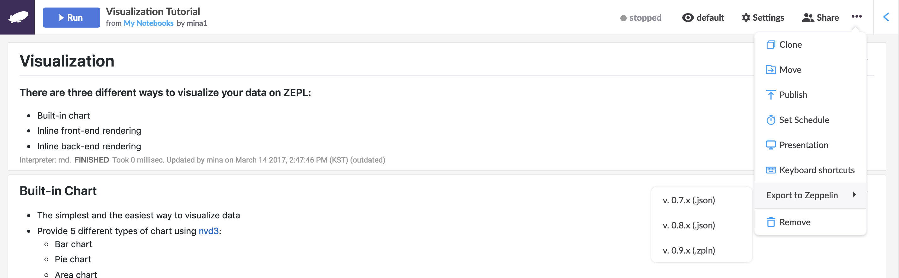
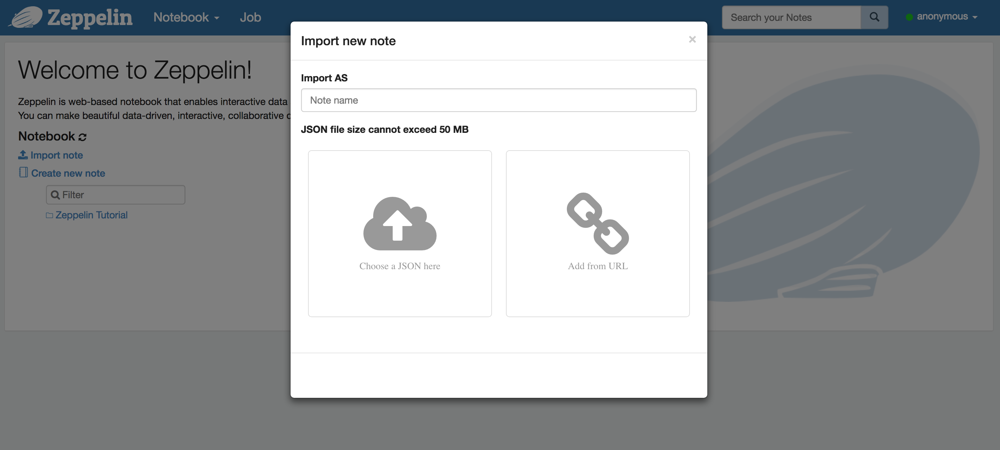

# Exporting Zepl Notebooks

Zepl supports exporting its native notebooks to the Apache Zeppelin format for use in your Zeppelin instances or for storage in an external repository.

## Export to the Apache Zeppelin Notebook Format

To export your notebook use the `Export to Zeppelin` menu item in the "..." menu at the top right of the notebook page as shown below:



Then select the version you'd like to export to and the file will be automatically downloaded to your local filesystem.

> Note: We currently support export to versions v0.7.x and v0.8.x in JSON format and v0.9.x in the `.zpln` file format.

## Importing into an Apache Zeppelin Instance

Use the `Import note` menu on the home page of your Apache Zeppelin instance as shown below:



## Apache Zeppelin File Size Limitations

If you encounter issues due to your downloaded notebook's file size being too large for your Apache Zeppelin instance (the default is 1MB) you can increase the limit by changing the `zeppelin.websocket.max.text.message.size` property in  `ZEPPELIN_HOME/conf/zeppelin-site.xml`. The example below sets the maximum limit to 50MB:

```xml
<property>
  <name>zeppelin.websocket.max.text.message.size</name>
  <value>52428800</value>
  <description>Size in characters of the maximum text message to be received by websocket. Defaults to 1024000</description>
</property>
```

Alternatively you can set the `ZEPPELIN_WEBSOCKET_MAX_TEXT_MESSAGE_SIZE` environment variable in `ZEPPELIN_HOME/conf/zeppelin-env.sh`. 

For more information on configuration please refer to the official [Apache Zeppelin documentation](https://zeppelin.apache.org/).
