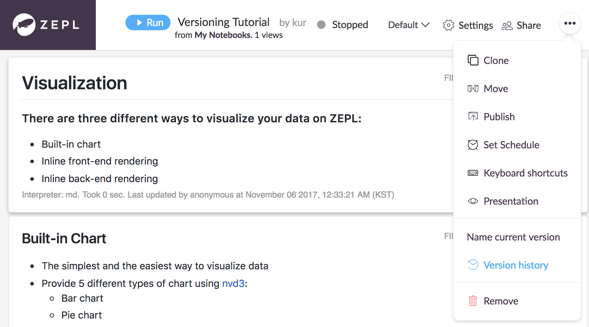
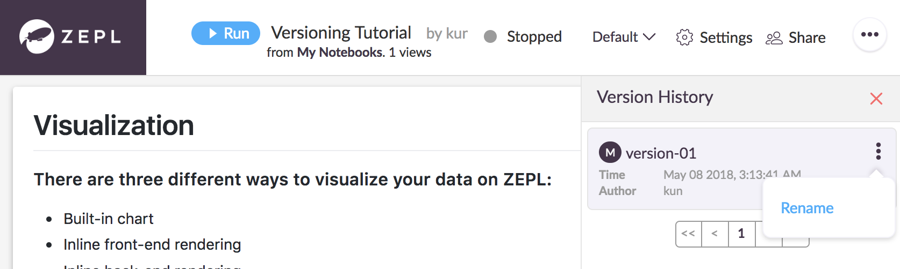
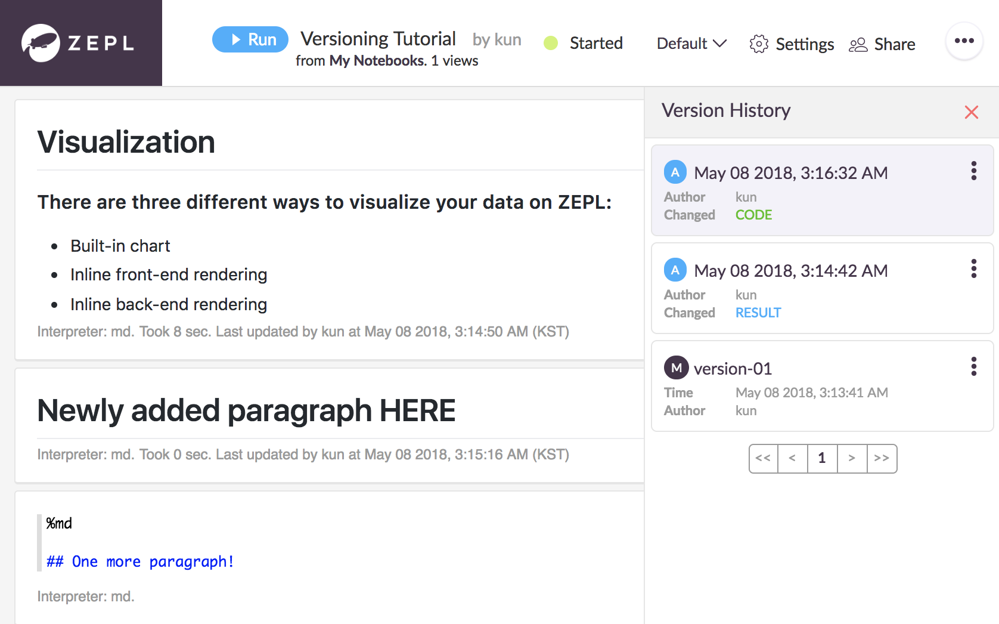
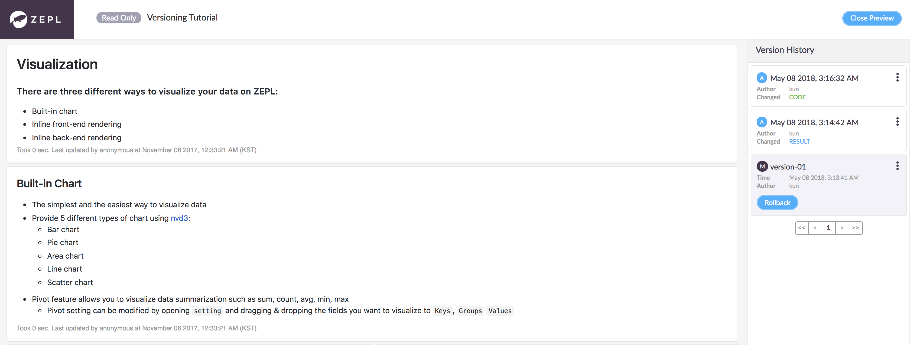

# Feature: Notebook Versioning 

Notebook versions can be created manually or automatically when some important changes are made. For instance, a paragraph is executed or code is modified.

Also it's possible to rollback the notebook into one of the previous versions. 

With the notebook versioning feature, Users are able to manage notebooks' history easily. In this documentation, We will see how we can use the notebook versioning features step by step.   

## 1. Create a version of a notebook manually 

To create a version of a notebook, Click the **Name current version** menu on the right side. After then insert the name you want to create.

 

 

   

## 2. Check version history menu 

You can check created versions by opening the **Version history** sidebar.

 

 

   

## 3. Rename created versions

Also, we can change the name of the versions. Click the **Rename** menu. 

 

   

## 4. Versions automatically created

When a paragraph is executed or code is modified in a paragraph, ZEPL creates versions automatically for the notebook. (`periodically`) Of course, we can rename the automatically created versions too. 

 

   

## 5. Rollback

To view the content of previous versions, click the name of a version. Then you will be able to see the old version's content. 

If you want to rollback into one of the versions, Click the **Rollback** button.

 

 

