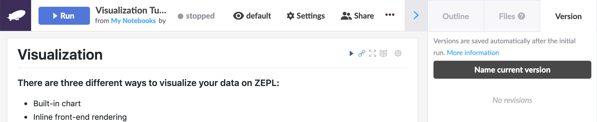
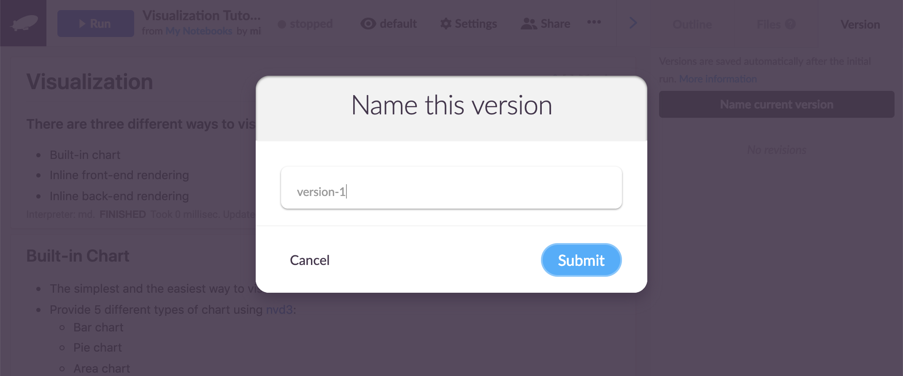
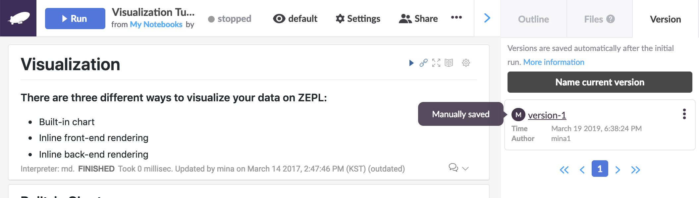
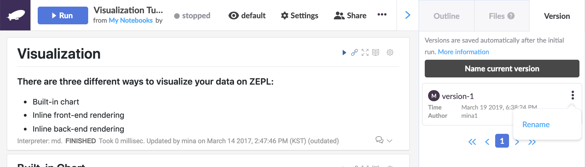
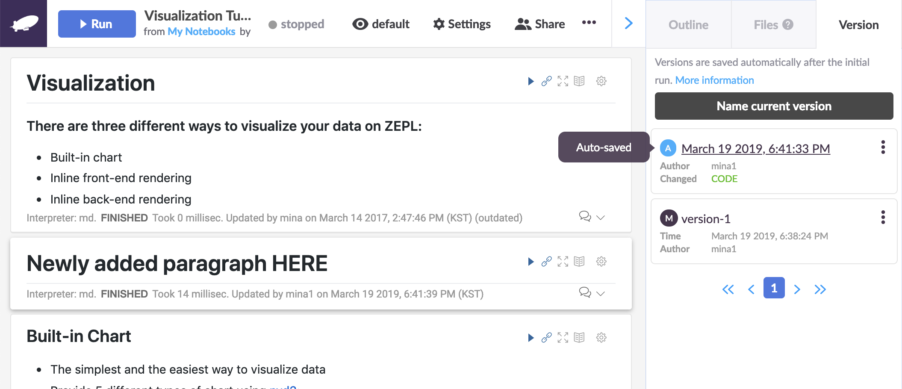
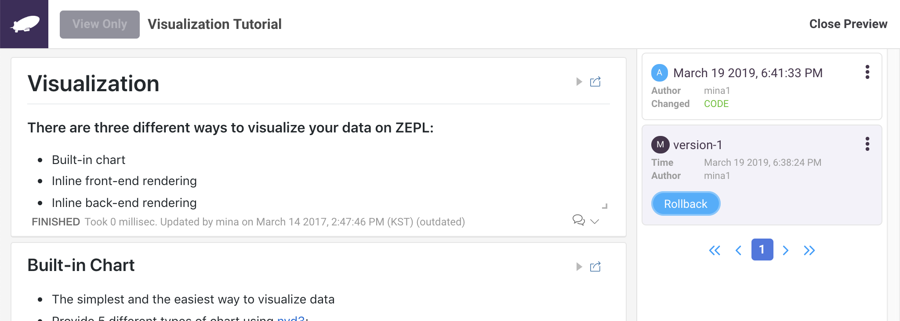
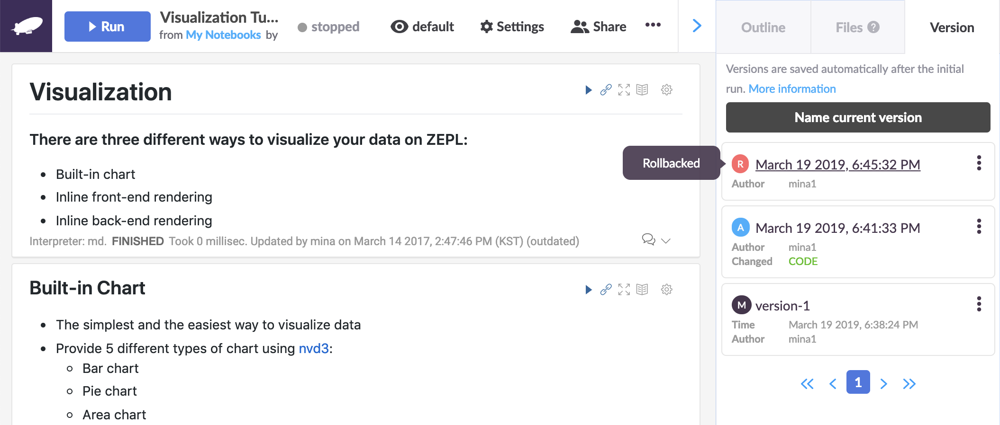

# Notebook Versioning

Notebook versions are created automatically when paragraphs are executed, code is modified or results change. Versions can also be named for easier identification and to act as a tagging system. Naming a version can also be used to create saved versions manually. And, of course, it's possible to rollback the notebook to any of the previous versions. 

## Creating a Version of a Notebook Manually 

To create a manual version of a notebook, click the *Name current version* item in the "..." dropdown menu on the top right side of the notebook page. Then enter the name you want in the *Name this version* dialog window that pops up and click *Submit*.

## Examining the Version History 

You can have a look at the list of saved versions by clicking the *Version history* item in the "..." dropdown menu on the top right side of the notebook page as shown below:

## Renaming Existing Versions

Existing versions can be renamed by clicking the kebab menu at the upper right of each version entry area and selecting *Rename* as shown here:

## Automatically Created Versions

When a paragraph is executed or code is modified in a paragraph, Zepl creates notebook versions automatically (at short time intervals). Of course, we can rename the automatically created versions too. 

 

## Rollbacking Back

To preview the content of a previous version, click its name in the version history list. A preview will be shown for verification with a *Close Preview* button appearing in the top right. Click that button if you'd like to cancel the operation and keep the current contents of the notebook. Otherwise click the *Rollback* button to proceed. The notebook will now roll back and refresh to the version you selected as shown below:

 
 

