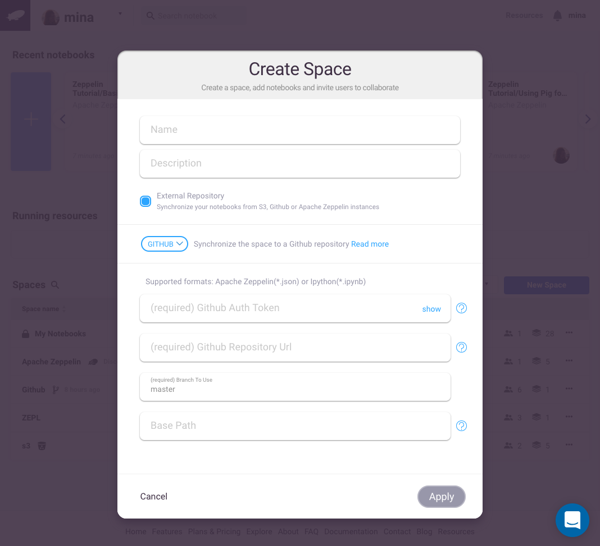
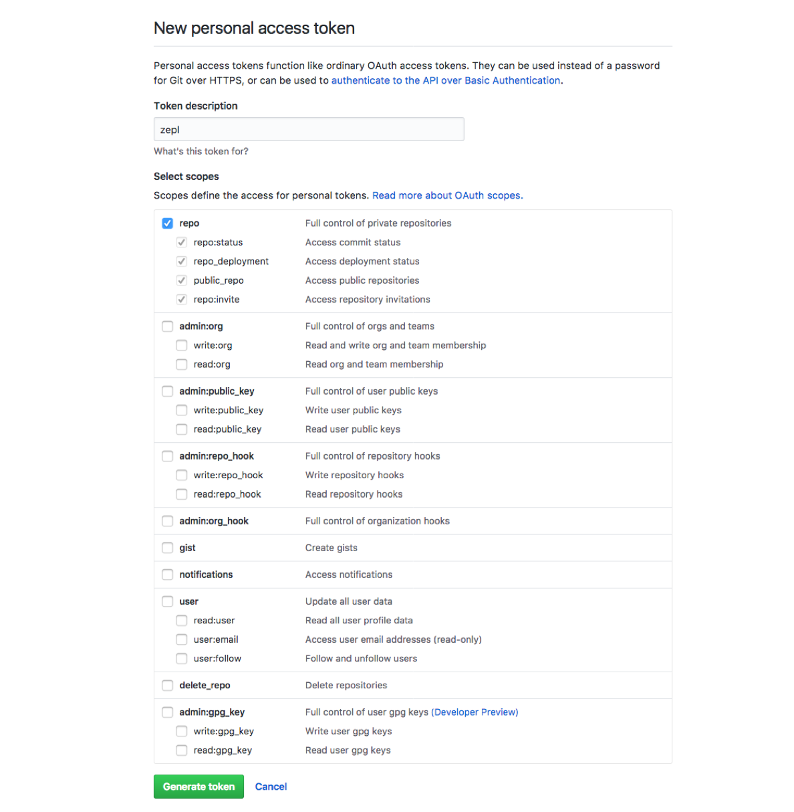
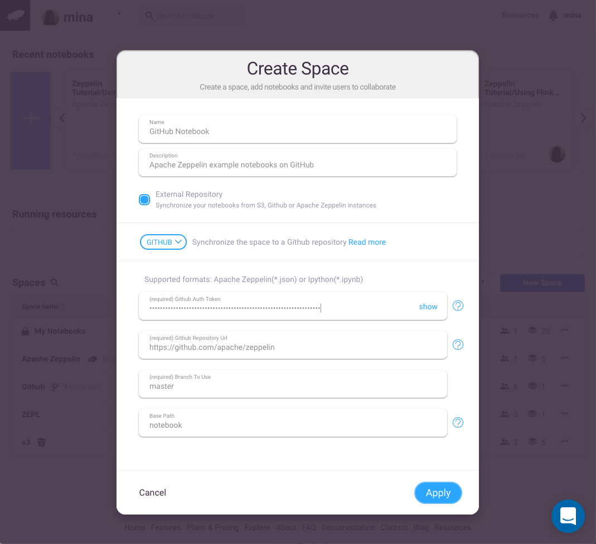
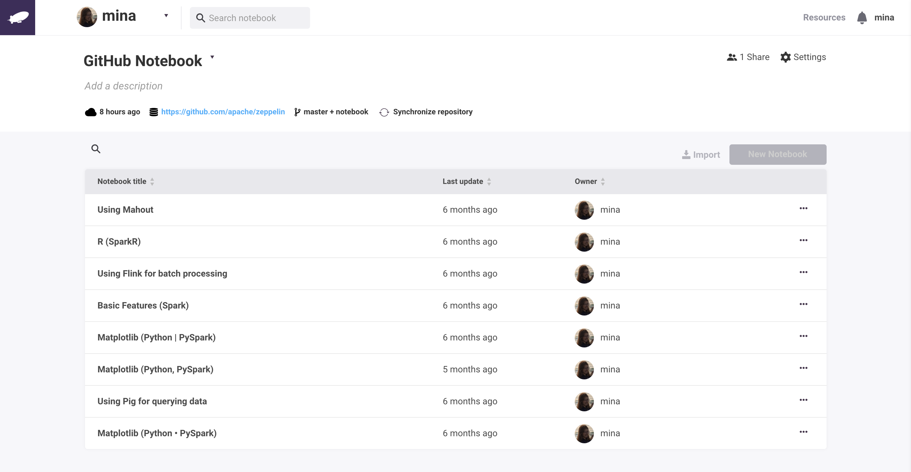

# Integrating with *GitHub*

*GitHub* is a popular online repository data scientists use to store their notebooks whether they be Zeppelin or Jupyter. Zepl supports integration of both notebook types from *GitHub* via *Spaces* as described below. Note that the files in *GitHub* must be in *JSON* (Apache Zeppelin) or *ipynb* (Jupyter) format.

>Note: *GitHub* synchronization is unidirectional from *GitHub* to Zepl so edits in Zepl do not get updated in *GitHub*. Also the notebooks from *GitHub* are read-only in Zepl and need to be cloned to modify.

## Creating a *GitHub* Repository *Space*

Click the *New Space* button in the main page to create a new *Space* and fill in the name and description fields. Then check *External Repository* and select *GitHub* from the dropdown menu.

### Connecting to a *GitHub* Repository

In order for Zepl to connect to your *GitHub* repository you will need a *GitHub* *repo* access scope token as pictured below.

Once *GitHub* is selected in the dropdown menu the following fields will need to be filled in:

* **GitHub* Auth Token*: copy the *GitHub* access token that you generated in the previous section
* **GitHub* Repository URL*: the URL of your *GitHub* repository
* *Branch to Use*: the branch name of the repo (if no branch name is set, Zepl will use the *master* branch by default)
* *Base Path* (optional): Zepl will recursively search this directory path for notebook files (if this field is not set Zepl will search from the repository's root path)

Below is an example of what the dialog window might look like:

You can now click *Apply* to create your *GitHub* *Space*. Zepl will first test the connection to the *GitHub* repository and if successful will redirect you to the newly created *Space* with all notebooks imported from the repository.

The *GitHub* space will automatically synchronize with the *GitHub* repository every 12 hours and will add new notebooks, update any modified notebooks, and remove any deleted notebooks. You can also manually re-trigger the synchronization.

You can now enjoy the power of Zepl with your notebooks stored in *GitHub*.

If you need help with *GitHub* tokens you can reference the [*GitHub* settings](https://github.com/settings/tokens) and [token generation *GitHub* documentation](https://help.github.com/articles/creating-a-personal-access-token-for-the-command-line/).
