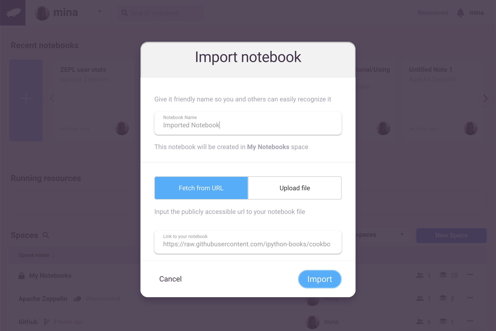
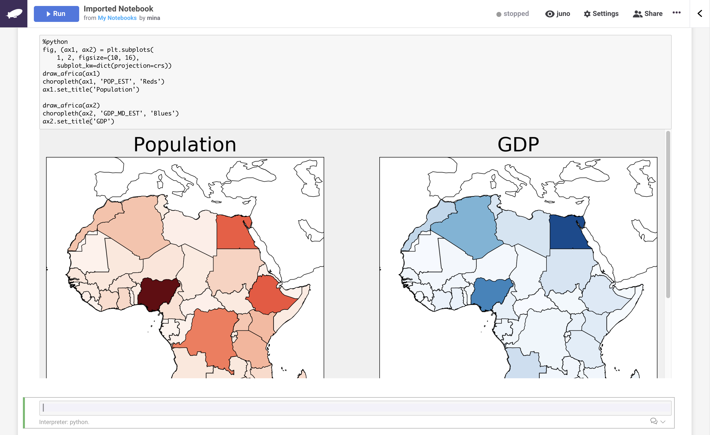

# Importing Notebooks into Zepl

Zepl allows you to leverage the functionality of an enterprise platform for versioning, collaborating with and sharing both your Zeppelin and Jupyter notebooks by importing them into your *Spaces*. This can be done in 2 ways:

* uploading notebooks directly to Zepl
* fetching notebooks from a publicly hosted location

To get started click the *Import Notebook* option from either the "kebab" menu in the *Spaces* main page or from the menu bar inside of a *Space*.

> Note: Currently only Jupyter 4.x or greater and Zeppelin up to v0.8.x are supported.

## Uploading Notebooks

Click *Select File* to upload a new file from your local filesystem.

> Note: The file size limit is 1 MB.

The notebook name will be auto-filled but you can rename it as you like.

## Importing from a URL

Click *Fetch from URL* to upload a new file from a publicly accessible host and enter the URL in the *Link to your notebook* field.

Once the upload is completed you will be redirected to the notebook.

## *Juno* Look and Feel

For those who are familiar with Jupyter notebooks and prefer a similar notebook format, Zepl includes the *Juno* view. If you import a Jupyter notebook the *Juno* view will be set automatically but you can change it once you open the notebook as demonstrated in the image below.

