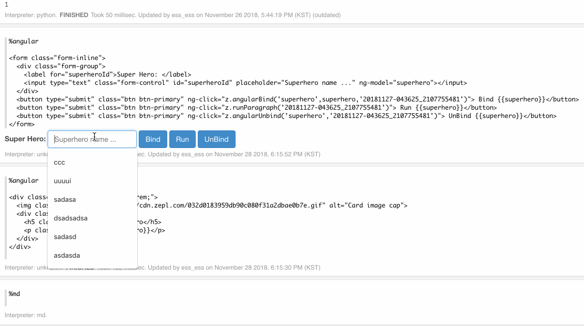

<h1> Angular interpreter </h1>

Please note that this feature is in beta and is only available for selected customers.

Angular interpreter is the port of Frontend Angular API in **Apache Zeppelin**
[Link](https://zeppelin.apache.org/docs/0.8.0/usage/display_system/angular_frontend.html#frontend-angular-api-in-apache-zeppelin).

Using AngularJS interpreter, you can render [AngularJS 1.7](https://docs.angularjs.org/misc/version-support-status#long-term-support) templates on ZEPL paragraphs and leverage the robust two-way binding system. Similar to **Apache Zeppelin** we expose a simple `AngularJS z object` on the front-end side to expose the same capabilities. This z object is accessible in the Angular isolated scope for each paragraph.

### API

| Actions             | API                                           |
|---------------------|-----------------------------------------------|
| Initiate binding    | z.angularbind(var, initialValue, paragraphId) |
| Update value        | z.angularbind(var, newValue, paragraphId)     |
| Destroy binding     | z.angularUnbind(var, paragraphId)             |
| Executing Paragraph | z.runParagraph(paragraphId)                   |

### Example

* In paragraph A(Find each paragraph's id in its context menu):

```
%angular

<form class="form-inline">
  <div class="form-group">
    <label for="superheroId">Super Hero: </label>
    <input type="text" class="form-control" id="superheroId" placeholder="Superhero name ..." ng-model="superhero"></input>
  </div>
  <p>We will bind {{superhero}} to next paragraph</p>
  <button type="submit" class="btn btn-primary" ng-click="z.angularBind('superhero',superhero,'20181127-043625_2107755481')"> Bind</button>
  <button type="submit" class="btn btn-primary" ng-click="z.runParagraph('20181127-043625_210775548')"> Run {{superhero}}</button>
  <button type="submit" class="btn btn-primary" ng-click="z.angularUnbind('superhero','20181127-043625_210775548')"> UnBind {{superhero}}</button>
</form>
```

* In paragraph `20181127-043625_210775548`:

```
%angular

<div class="card" style="width: 18rem;">
  
  <div class="card-body">
    <h5 class="card-title">SuperHero</h5>
    <p class="card-text">{{superhero}}</p>
  </div>
</div>
```

