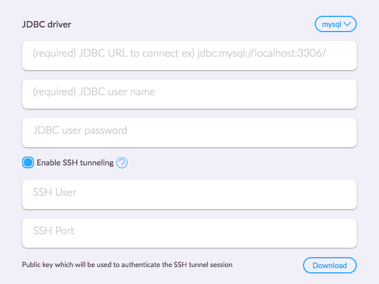

<h1> JDBC Interpreter </h1>

ZEPL supports JDBC interpreter with drivers for popular databases. Before connecting to your database, it's important to check the following:

  - Database is currently up and running
  - Database is accessible from public internet
  - You have proper credentials to access database
  
<br/>

## Create new JDBC Interpreter

First, you'll need to create an intepreter to provide database connection information.

1. Click **Create interpreter** button from [Interpreter](https://www.zepl.com/settings/interpreters) page.
2. Select **jdbc** in Interpreter group
3. Provide an **Interpreter name**. This name will be used in the notebook to call this JDBC interpreter.
4. Provide a **JDBC connection URL**, **username** and **password**.
5. Select a **JDBC driver**

Use the **Test connection** button to test the connection.

### Use your JDBC Interpreter

Once you have created the JDBC interpreter, you can use it in your notebook by providing the `%[Interpreter name]` directive. For example, if you have created your JDBC interpreter with name "psql", you can use `%psql` in the notebook. i.e.

```
%psql
SELECT * from my_table
```

<br/>

## Secure database connection

### Whitelist IP addresses
ZEPL connects your database using IPs addresses above Thus it's required to setup firewall and whitelist the IP.
    - **35.164.138.115**
    - **52.24.205.101** 
    - **34.214.146.198**

<br/>

### Connecting to a database in private network with an SSH tunnel

To connect to a database in a private network, create an SSH tunnel using the following steps:

#### Create a new JDBC interpreter

* Go to ZEPL Interpreters page and click **Create interpreter**.
* Select **JDBC** from the **Interpreter group**.
* Enable SSH tunneling.



<br/>

#### Setup the public key

(1) Download our public key from the popup and whitelist these IPs through your firewall.
- **35.164.138.115**
- **52.24.205.101** 
- **34.214.146.198**

(2) Create a user account for ZEPL

```sh
ubuntu@user:~$ sudo useradd zepl
```

(3) Since ZEPL authenticates via public key, there's no need to set a password.
Authorize the key by opening up `default.ssh.public_key` (the downloaded file)
and pasting its contents into a new line in `/home/zepl/.ssh/authorized_keys`.
Make sure `authorized_keys` file has **600** permission.

(4) In most cases the SSH Port will be 22 by default. Check the Port variable in
`/etc/ssh/sshd_config` to see which port is used for SSH.

```sh
ubuntu@user:~$ cat /etc/ssh/sshd_config | grep Port
Port 22
```

Now you can use your newly created interpreter with your notebooks
to query and process data.
