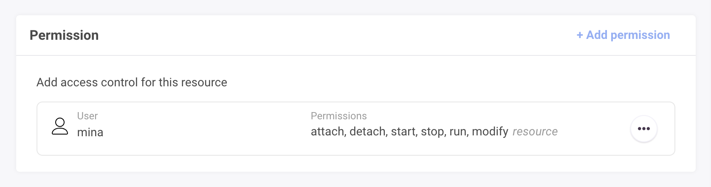
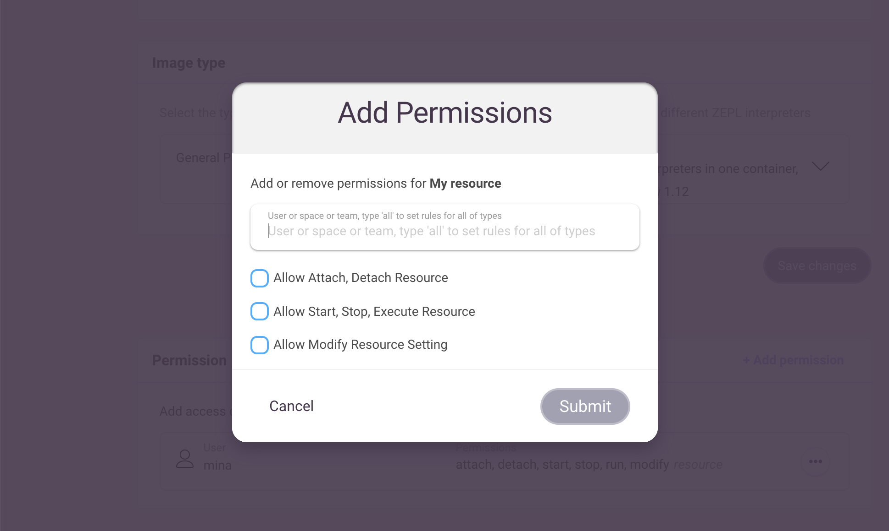
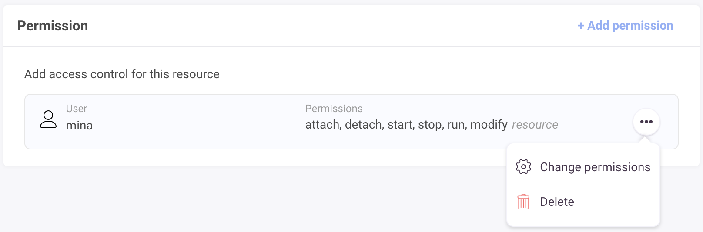
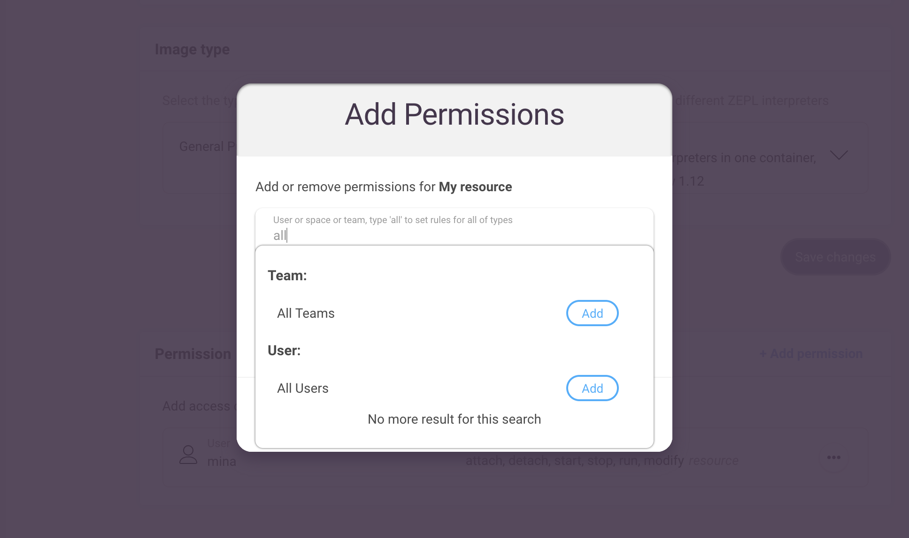

# Resources in Zepl

A Resource must be attached to a Zepl Notebook before it can be executed.
Resources in Zepl determine which interpreters will be available and which type of physical resource (e.g CPU, RAM, etc.) will be allocated to execute the notebook.

## Attaching a Resource to a Notebook

You can select a resource when you create or clone a notebook. 

You can also switch a notebook's attached resource after the notebook has been created through the notebook's *Settings* menu in the top right of the window.

>Changing the attached resource will cause any running containers to be shutdown.

## Resource Management

>Note: only an organization's admin can create and manage a resource  

Click *Resources* from the top right area of the main page.

### Creating & Updating Resources

Zepl provides a *Simple Workload* as the default resource. Additional resources can be created to customize the capabilities and capacity of attached notebooks.

To create a new resource click the *New Resource* button. The following form should appear.

Give the new resource a name and description.

### Configuration

  - *Resource type*: select the container size for the running notebook (each resource type consumes hour units at different rates)
  - *Idle shutdown time*: the resource for a notebook will shutdown automatically if the container is idle for the set amount of time
  - *Max concurrent running notebooks*: the maximum number of notebooks which can be attached to this resource at the same time
  - *Processing time limit*: a limit to the total time that this resource can run across all notebooks - it's useful in preventing over-consumption of resources and capping the associated fees (*this is currently ignored*)
  - *Set as default resource*: sets resource to be selected by default when you create (clone) a notebook
  - *Image type*: defines which interpreters and tools are provided in the container in which the notebook will run

You can edit the resource's settings by clicking on its name or on the *Change Setting* item in the "..." menu to the right of the resource entry in the list on the *Resource settings* page.

> Note: You cannot change the container type or the image type after the resource is created. Create a new resource to do so.

### Deleting Resources

After a resource is deleted, all containers for that resource will be shutdown and any notebooks that have the deleted resource attached will be set to the default resource. If you're trying to delete the default resource, the next available resource in the resource list will be set as the next default resource.

## Resource Permissions

Users share resources within an organization. You can make use of resource permissions to control the usage of these resources by members of the organization.
After the introduction of resource permissions users can attach resources
to notebooks and run them.

>Note: [View only and Edit permissions](/guide/sharing_notebooks/#more-about-sharing-options) set while sharing
notebooks can only be used to restrict editing of notebooks and not
restrict their execution.

There are three different permissions presets which can be applied to users
or [user groups](/faq/#what-are-the-different-roles-available-in-Zepl-what-rights-do-each-have) such as team groups (members/managers) or *Space* user groups
 (members/collaborators/managers)

* *Allow Attach, Detach Resource on a notebook*
* *Allow Start, Stop, Execute Resource*
* *Allow Modify Resource Setting*

Please note that these permissions do not depend on each other or have
precedence over each other. You will have to be explicit on permissions.
A user who doesn't have attach permission can still have edit permission.
Also giving permission to a specific user group doesn't give permission
to a higher user group. For example, giving edit permission to users of a *Space* 
doesn't give edit permission to managers of that space.

### Creating a Resource Permission

Initially only resource admins can configure permissions for resources after which users given edit permission would be able to do this.

* To add permissions go to a resource's edit page and click the
`Add permissions` button.

* Fill in the name of a user, *Space* or *Team*.

* Check the desired permissions and click `Submit`.

### Editing or Deleting Resource Permissions

You can use the "..." menu on the right of the permissions entry in the list to edit or delete specific resource permissions.

#### Creating Generic Permissions

To give permission to all users of a certain type, such as
all users or all space collaborators or all team managers, type `all`
in the search box.

Be aware that permissions operate as follows:

* specific user rules will overwrite all-user rules
* specific team rules will overwrite all-team rules
* specific space rules will overwrite all-space rules
