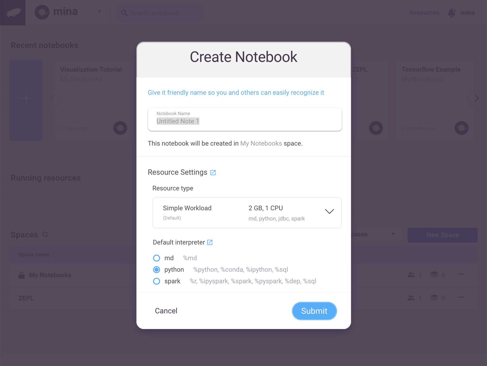
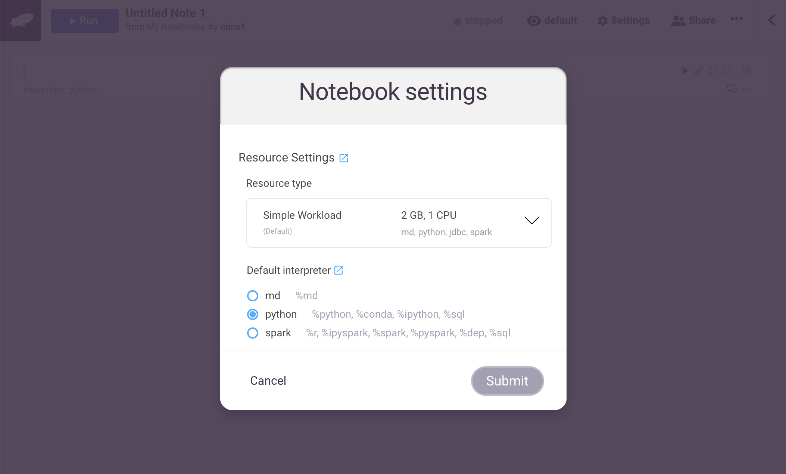
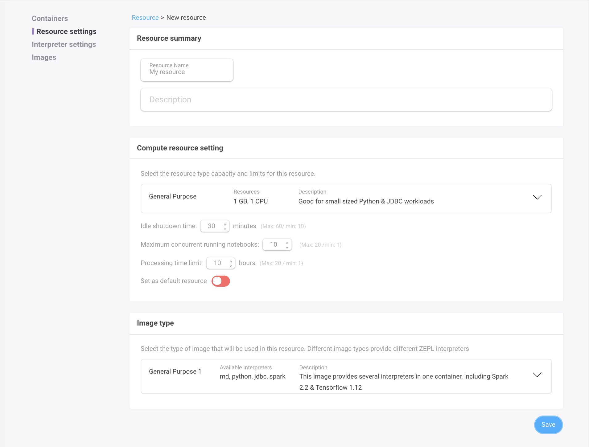
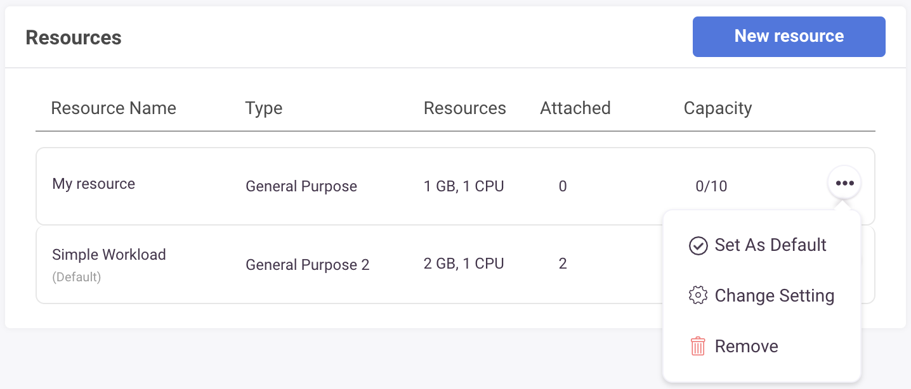

<h1>Resources in ZEPL</h1>

A Resource must be attached to a ZEPL Notebook before it can be executed.
Resources in ZEPL determine which interpreters will be available and what type of physical resource(e.g CPU, RAM ...) will be allocated to execute the notebook.

## Attach Resource to Notebook

You can select a resource when you create(or clone) a notebook. 

You can also switch a notebook's attached resource after the notebook has been created through the "Notebook Settings" menu item (click gear icon in top-right side corner of the notebook).
Changing the attached resource will cause any running containers to be shutdown.

 

## Resource Management
 *NOTE* : Only an organization's admin can create and manage a resource  

Select the "Resources" menu item from the main menu (Click the avatar icon at top-right side of the corner).

### Create/Update Resource
ZEPL provides **Simple Workload** as a default resource.  
Additional resources can be created to customize the capabilities and capacity of attached notebooks.

To create a new resource, Click "New Resource". The following form should appear.

 

### Configuration

  - **Resource type**: Select the container size for the running notebook. Each resource type consumes hours units at different rates.
  - **Idle shutdown time**: Resource for a Notebook will shut-down automatically if the container is idle for the set amount of time
  - **Max concurrent running notebooks**: The maximum number of notebooks which can be attached to this resource at the same time
  - **Processing time limit**: A limit to the total time that this resource can run across all notebooks. It is useful to prevent over-consumption of resources and cap the associated fees. This is currently ignored.
  - **Default resource setting**: Set resource to be selected by default when you create(clone) a notebook 
  - **Image type**: Different image types provide different ZEPL interpreters. Currently there is only one image, but more will be added in the future.

You can update the resource settings by clicking its the name or by clicking on the menu item from the **Resources** main page.

You cannot change the container type or the image type after the resource is created.
Create new resource if you want a different container resource type and image type.
 
### Delete Resource

After a resource is deleted, all containers for that resource will be shutdown, and any notebooks that have the deleted resource attached will be set to the default resource.
If you're trying to remove **Default Resource**, the next available resource in the resource list will be set as the next default resource.

