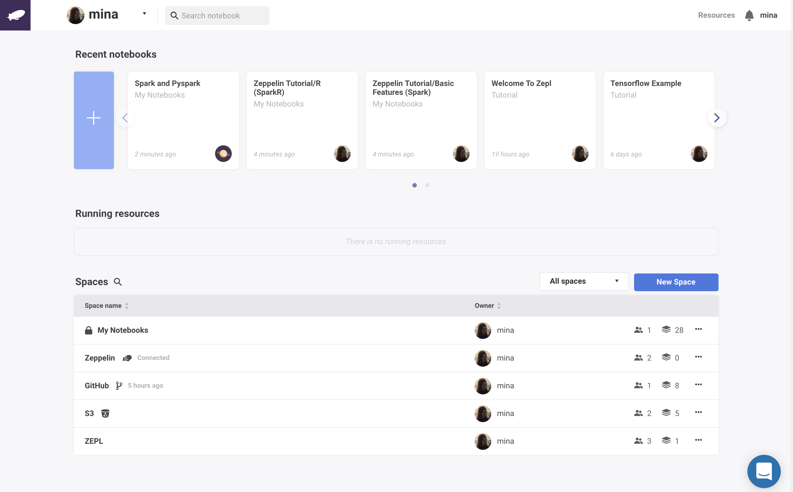
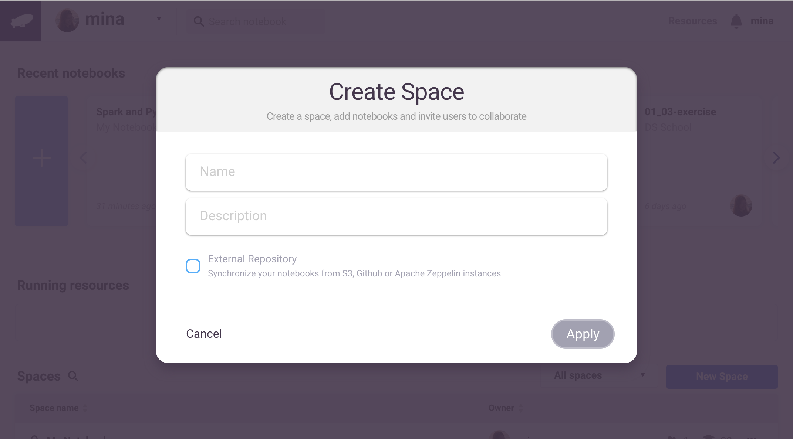
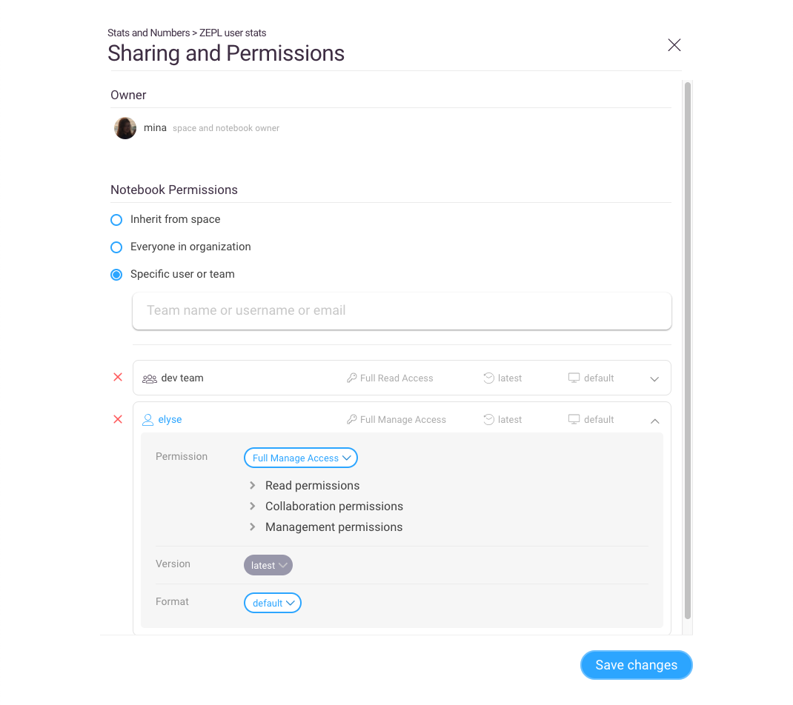
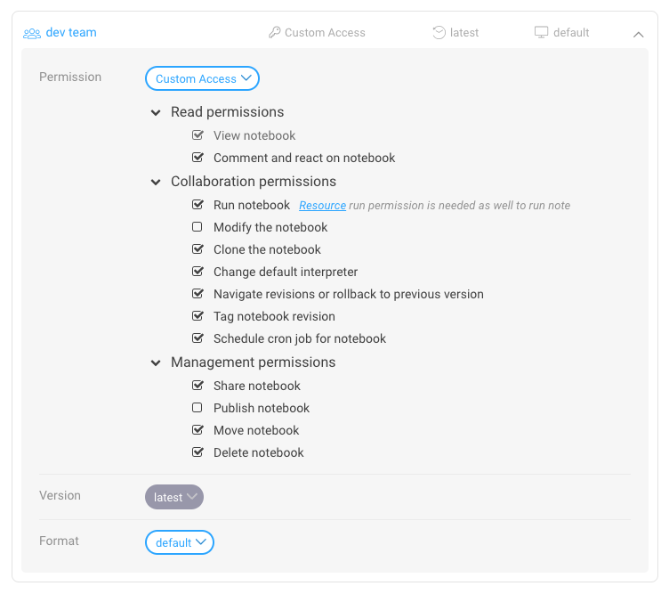
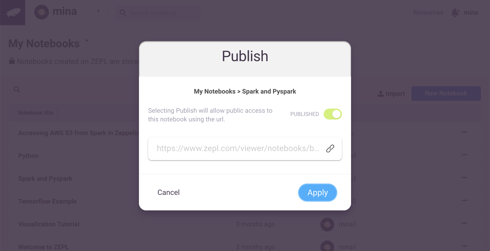

# Spaces and Notebooks Sharing

In this section we will explain how you can create a new *Space* and share notebooks with other members and teams.

# What is a *Space*?

A Zepl *Space* is simply a collection of notebooks. Both members and teams in an *Organization* can be invited to a *Space* and can be granted permission to share and collaborate on the notebooks within.

# Creating a new *Space*
Click the *New Space* button on the main page to create a new *Space*.

Give your *Space* a name and a short description.

Zepl offers the ability to import notebooks from several external sources when creating a *Space* if desired. To do so check the *External Repositories* checkbox which will display the current options available: [Apache Zeppelin](../zeppelin_integration) notebooks, notebooks stored in [Github](../github_integration) and in [AWS S3](../s3_integration).

> Note that the synchronized notebooks are read-only and in order to run/execute them you'll need to clone them first.

## Sharing *Spaces*
After creating a new *Space* you can share it with other members or teams or with the entire *Organization*. Members of a *Space* are able to access all notebooks that belong to the *Space*.

 

## Sharing Notebooks
Zepl provides fine-grained access control for sharing notebooks with others as shown in the following image.

 

**Permissions**

There are three preset permission policies to choose from:
* Full Read Access: allows members to view and comment on the notebook
* Full Collaborate Access: *Full Read Access* plus the ability to edit, schedule, version and run the notebook
* Full Manage Access: *Full Collaboration Access* plus the ability to publish, share, move and delete the notebook
  
You can choose from one of these or grant your own custom permissions by making the appropriate selections in the dialog window. Note that in addition to the *Run notebook* permission option, a member must have the *Allow Start, Stop, Execute Resource* permission granted in the [*Resource* permissions](resource_mgmt/#permissions-for-resources) area for the notebook's assigned resource in order to run the notebook. A quick link to the *Resource* permissions settings page appears next to the *Run* option for convenience.

**Version**

This is currently hard-coded to the latest version of the notebook.

**Format**

Zepl supports several different visual styles:

* default: grey background notebook theme
* simple: white background notebook theme with smaller paragraph padding
* report: minimizes the number of icons and shows them only on mouse-over
* Juno: *Jupyter*-like styling

# Publishing Notebooks to the Web
You can both share and publish notebooks from the *Spaces* main page using the "..." menu to the right of the notebook name. Publishing a notebook provides a URL for use elsewhere and will automatically render the notebook public. Anyone who has access to this URL will be able to view the notebook in read-only mode. To make the notebook private again simply re-open the *Publish* dialog and toggle the control back to the *UNPUBLISHED* state. Unpublished notebooks are only accessible to Zepl members who have been granted access rights via the sharing mechansim described above.

