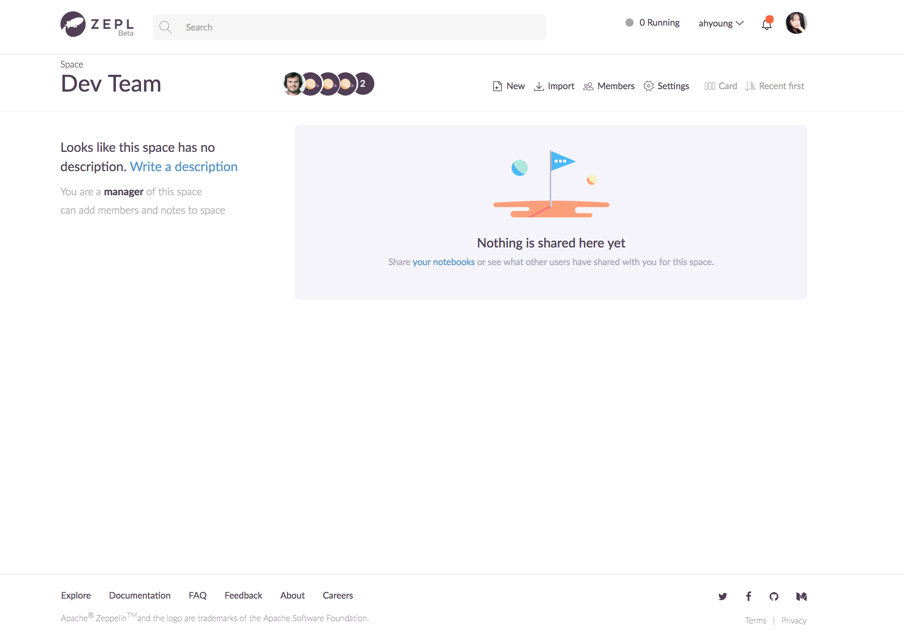
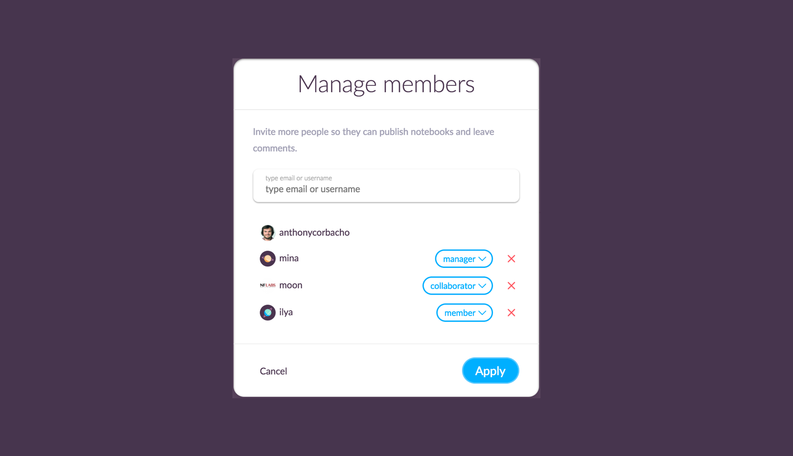

# Sharing Notebooks

In this section, we will explain how you can create a new space and share notebooks to other spaces, users and team members.

# What is Space?

A ZEPL space is like a folder where notebooks can be collected and shared to others.
Once a space is created, you have the ability to invite other team members to join the space. Only members of the space have access to the shared notebooks that is contained in that space.

 
# Create a new Space
Click **"New Space"** button in the main page to create a new Space.

And write a space name with short description.
(In this case, you don't need to care about any external repositories)

To connect the space to an external repository like AWS S3, Github or Apache Zeppelin and sync your notebooks, see the following links for the detailed information.

  * [How to connect to Apache Zeppelin](../zeppelin_integration)
  * [How to connect to Github](../github_integration)
  * [How to connect to S3](../s3_integration)

Since you created this space, you are also the space's owner. You can invite collaborators and manage the shared notebooks in here.

<br/ >

## Sharing Notebooks to Spaces
You can share and [publish the notebook](exploring_notebook.md) in **Spaces** main page.

Or you can find **Share and Publish** button in top-right corner of each notebook and directly do in it.
 

## More about sharing options

 
While you are sharing your notebook to other users or to spaces, you can
configure three options:

**Permission**

* View - Allows others to only view the notebook
* Edit - Allows shared party to edit the notebook(If you share notebooks
with this option enabled, your interpreter will be used when the
notebook is executed)

**Format**

Same as three visual modes in Apache Zeppelin

* Default
* Simple
* Report

You can allow the shared party to access your notebooks only in the specified visual mode

**Version**

ZEPL can leverage the version control system as in Apache Zeppelin,
you can share a specific revision of your notebook with a user or a space

 
# Publishing Notebooks to web

You can set your notebook to public or private mode in the same dialog used when you share a notebook.

The default value of each notebook is **Unpublished**. It means the notebook is set as private mode.
So no one would be able to access the notebook, except the ZEPL users that it has been shared with, and public URI won't work in this status.

If you want to make your notebook public and anyone can access to it, just slide the toggle bar.
It will generate the public URL for the notebook. Just copy to the clipboard and visit the site.

Optionally you can select the showcase where your public notebook is located.
Of course you can choose multiple showcases at a time. If you have no idea about **Showcases** yet, please read [What is the showcase?](exploring_notebooks.md#what-is-the-showcase) section first.
Then you can see your notebook under the showcase you chose in **Explore** tab.

 
# Inviting people to the Space
In the space, you can invite collaborators. Once someone is added to your space, he/ she can see your space in his **Shared** page.

 
## User roles in space

While adding new members to space, you can decide what role they have in
your space. Each role will have specific powers over the space

* Manager: Manager of space can add or remove users, change user roles,
add or remove notebooks from space and view or edit notebooks that are
shared to the space

* Collaborator: Collaborator of a space can add or remove notebooks and
view or edit notebooks that are shared to the space

* Members: Members can only view or edit notebooks that are shared to
the space

 

Give some feedback by leaving comments on the shared notebook.
You can find **conversation button** at the top of the each paragraph and start a conversation with your people about the report.

