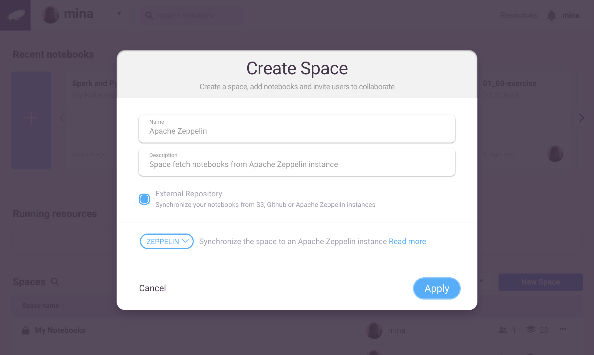
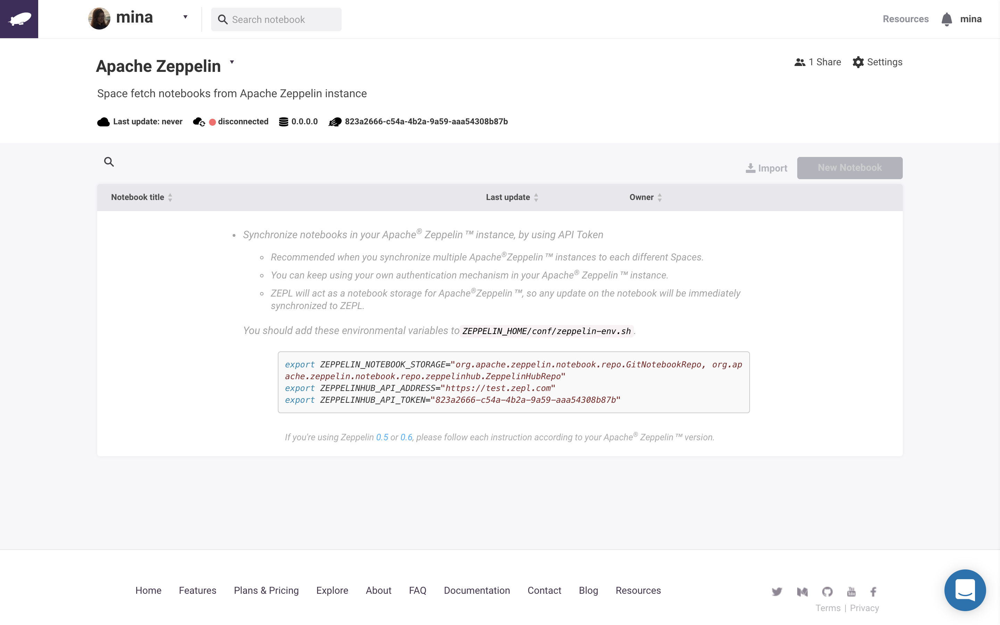
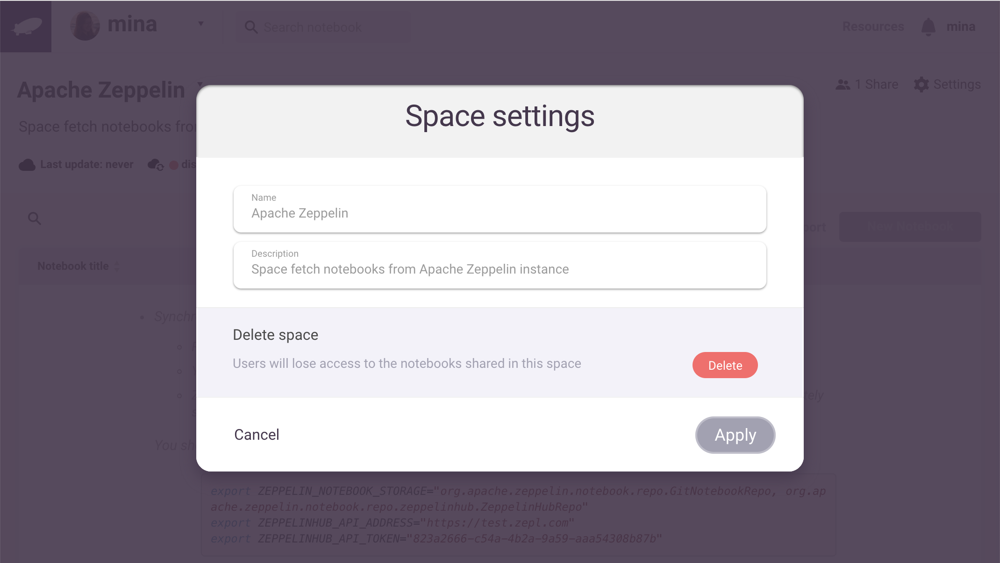

title: Zeppelin Integration | ZEPL Documentation
# Apache Zeppelin Notebook Integration

Apache Zeppelin is a popular open-source data science notebook platform which can leverage Spark for big data analysis and produce beautiful charts and graphs for displaying insights. Zepl, being of the same lineage for SaaS and Enterprise users, naturally integrates with Zeppelin notebooks. This is done via Zepl *Spaces*.

## Create a Zeppelin Instance *Space*

Click the *New Space* button in the main page to create a new *Space* and fill in the name and description fields. Then check *External Repository* and select *Zeppelin* from the dropdown menu.



Once the *Space* is created, Zepl will produce a unique token which you can use to connect Zepl to your Apache Zeppelin instance.



You can edit the new *Space*'s settings by using the *Settings* dropdown menu item in the "..." menu to the right of the *Space*'s block.



## Connecting Zepl with Apache Zeppelin

### Setting the Apache Zeppelin environment variables

#### Preparation for Synchronization

In order to synchronize your Zeppelin instance to your Zepl account you'll need to set three environment variables in your `ZEPPELIN_HOME/conf/zeppelin-env.sh` file for Linux/macOS or in your `ZEPPELIN_HOME/conf/zeppelin-env.cmd` file for Windows: ZEPPELIN_NOTEBOOK_STORAGE, ZEPPELINHUB_API_ADDRESS and ZEPPELINHUB_API_TOKEN.

> If you don't already have this file you can create it by copying the `ZEPPELIN_HOME/conf/zeppelin-env.sh.template` or `ZEPPELIN_HOME/conf/zeppelin-env.cmd.template` file as follows (replace *sh* with *cmd* for Windows):

```
    $ cd ZEPPELIN_HOME/conf
    $ cp zeppelin-env.sh.template zeppelin-env.sh
```

Now copy your generated token from your new Zepl *Space*.


Then edit the `zeppelin-env.sh` or `zeppelin-env.cmd` file to add the environment variables as follows according to the Zeppelin version in use:

#### Zeppelin-0.6.X for Linux / macOS

```sh
export ZEPPELIN_NOTEBOOK_STORAGE="org.apache.zeppelin.notebook.repo.VFSNotebookRepo, org.apache.zeppelin.notebook.repo.zeppelinhub.ZeppelinHubRepo"
export ZEPPELINHUB_API_ADDRESS="ADDRESS_OF_ZEPPELINHUB_SERVICE" (e.g. https://www.zepl.com)
export ZEPPELINHUB_API_TOKEN="YOUR_TOKEN_STRING"
```

#### Zeppelin-0.6.X for Windows

```sh
set ZEPPELIN_NOTEBOOK_STORAGE=org.apache.zeppelin.notebook.repo.VFSNotebookRepo, org.apache.zeppelin.notebook.repo.zeppelinhub.ZeppelinHubRepo
set ZEPPELINHUB_API_ADDRESS=https://www.zepl.com
set ZEPPELINHUB_API_TOKEN=YOUR_TOKEN_STRING
```

#### Zeppelin-0.7.x single user for Linux / macOS

```sh
export ZEPPELIN_NOTEBOOK_STORAGE="org.apache.zeppelin.notebook.repo.GitNotebookRepo, org.apache.zeppelin.notebook.repo.zeppelinhub.ZeppelinHubRepo"
export ZEPPELINHUB_API_ADDRESS="ADDRESS_OF_ZEPPELINHUB_SERVICE" (e.g. https://www.zepl.com)
export ZEPPELINHUB_API_TOKEN="YOUR_TOKEN_STRING"
```

#### Zeppelin-0.7.x single user for Windows

```sh
set ZEPPELIN_NOTEBOOK_STORAGE=org.apache.zeppelin.notebook.repo.GitNotebookRepo, org.apache.zeppelin.notebook.repo.zeppelinhub.ZeppelinHubRepo
set ZEPPELINHUB_API_ADDRESS=https://www.zepl.com
set ZEPPELINHUB_API_TOKEN=YOUR_TOKEN_STRING
```

#### Zeppelin-0.7.x multiple users on Zeppelin server for Linux / macOS

```sh
export ZEPPELIN_NOTEBOOK_STORAGE="org.apache.zeppelin.notebook.repo.GitNotebookRepo, org.apache.zeppelin.notebook.repo.zeppelinhub.ZeppelinHubRepo"
export ZEPPELINHUB_API_ADDRESS="ADDRESS_OF_ZEPPELINHUB_SERVICE" (e.g. https://www.zepl.com)
```

In this multi-user scenario you don't need your token as it will be automatically recognized from your new Zeppelin *Space*. In order to login with your Zepl credentials, you will need to complete the steps in the [next section](#login-to-apache-zeppelin-07x-with-zepl-credentials).

You may also find up-to-date instructions on integrating the latest Apache Zeppelin master branch with Zepl on the [Apache Zeppelin documentation website](https://zeppelin.apache.org/docs/0.7.0-SNAPSHOT/storage/storage.html#storage-in-zeppelinhub).

### Login to Apache Zeppelin 0.7.x with Zepl credentials

Starting with the `0.7.x` release, Apache Zeppelin has added more multi-user support functionality so we made it possible to login to Zeppelin with your Zepl credentials in case multiple users are using the same Zeppelin server. For the best integration experience we recommend that you use the latest release of Zeppelin (currently `0.8.1`).

After you set the environment variables mentioned in [the previous section](#zeppelin-07x-multiple-users-on-zeppelin-server), you'll need to modify your `conf/shiro.ini` security configuration file. If you don't have this file, you can copy it from `ZEPPELIN_HOME/conf/shiro.ini.template` as follows:

```
$ cd ZEPPELIN_HOME/conf
$ cp shiro.ini.template shiro.ini
```

Then modify the section under `### A sample for configuring ZeppelinHub Realm` as shown below:

```
#### A sample for configuring ZeppelinHub Realm
zeppelinHubRealm = org.apache.zeppelin.realm.ZeppelinHubRealm

### Url of ZeppelinHub
zeppelinHubRealm.zeppelinhubUrl = service_url
securityManager.realms = $zeppelinHubRealm
```

> Note that instead of `service_url` you should specify the URL of your Zepl service (e.g. https://www.zepl.com).

You can now login to Zeppelin using your Zepl account credentials.

## Start the Apache Zeppelin daemon

Finally, start (or restart) Apache Zeppelin.

```
$ cd ZEPPELIN_HOME
$ ./bin/zeppelin-daemon.sh start (or restart)
```

Then return to Zepl and the indicator shown below should indicate that Zeppelin is properly connected.


