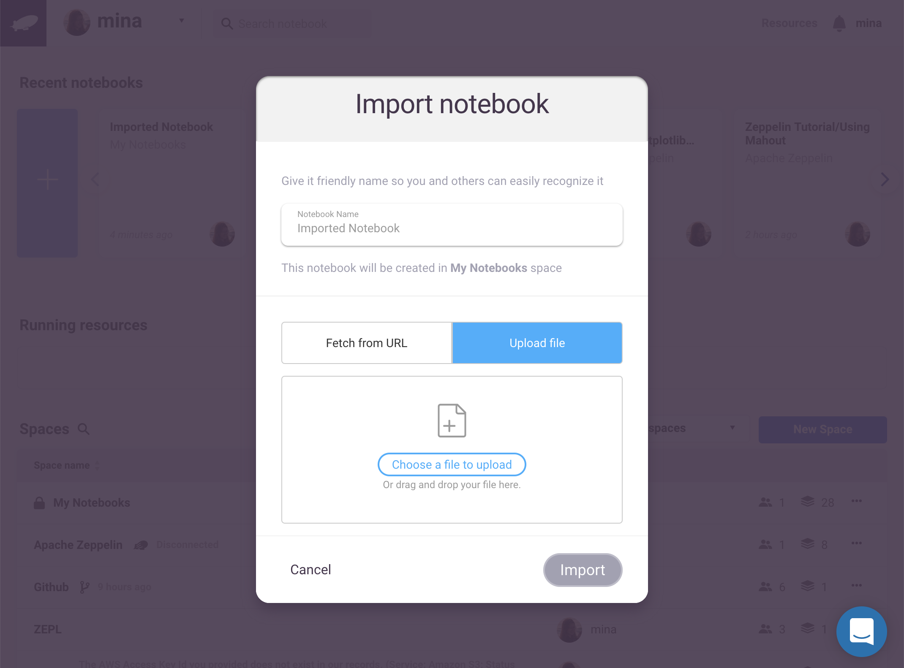
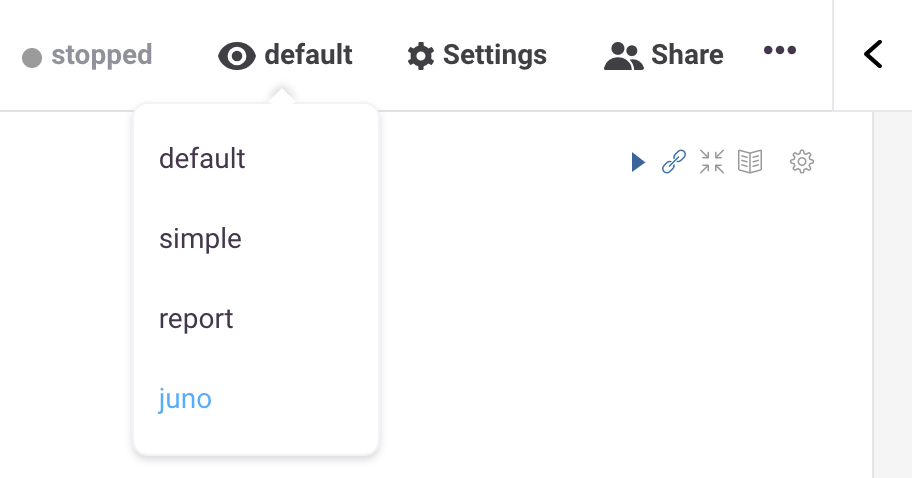

Importing notebooks into ZEPL and JUNO

ZEPL is a service where your Apache Zeppelin and Jupyter Notebooks can be brought together to the same platform for sharing and collaboration. You can import your Apache Zeppelin and Jupyter notebooks into ZEPL. There are two methods to import a notebook -
* Upload it directly to ZEPL
* Fetch from a publically hosted location

** NOTE :** As of now only Jupyter version >= 4 is supported.

## To upload a notebook

Click New button from the title bar.

Select ** Import ** option.

Click ** Select File ** to upload a new file.

** NOTE :** File size limit- 1 Mb.

The notebook name will be auto filled, or you can choose to give it a unique title.

## To import from url

Host the notebook to a publically available location
Paste the URL in the input.

Once the upload is completed, you will be redirected to the notebook.

# JUNO Look and feel

Juno is a NASA space probe orbiting the planet Jupiter.

If you are someone who is familiar with Jupyter notebooks and want the familiar feeling out of ZEPL, you can go for JUNO look and feel. If you import a Jupyter notebook, the default look and feel mode would be JUNO(You can change it later inside the notebook, if you want). You can share notebooks in JUNO mode too.

