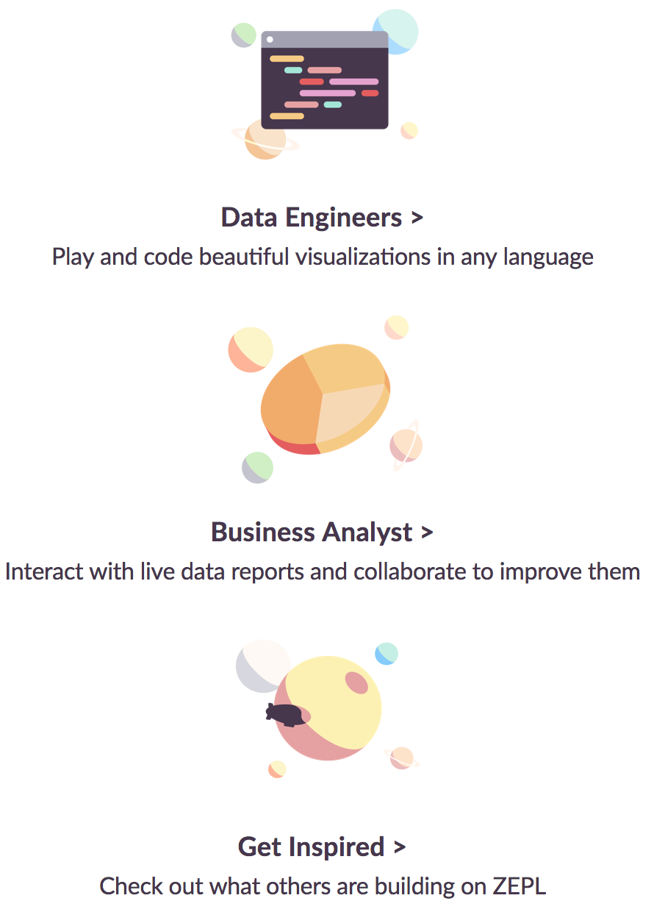

ZEPL Documentation

All-in-one platform, build and share it to the world. 
You’ll never send a graph in PDF or Powerpoint again.
 
[ZEPL](https://www.zepl.com/) is where data professionals meet to build amazing graphical reports and collaborate on analytic workflows online.

 Modular notebooks

Powered by Apache Zeppelin, you can make beautiful data-driven, interactive and collaborative notebooks with SQL, Python and more.

 Quick data visualization

Connect direct to your data or backend system, and visualize using the built-in charts and pivot functions.

 Collective work

Share your notebook with anyone, anywhere. Instantly communicate and show your changes on the fly. Simplify the feedback process allowing teammates to comment directly on your work.

 

Who uses ZEPL?

 

Show your notebooks on ZEPL

Visualize your public notebooks hosted anywhere and share the best of your work in [ZEPL Explore](https://www.zepl.com/explore) page.
See [Explore Public Notebooks](exploring_notebooks.md) section for more detailed information.
