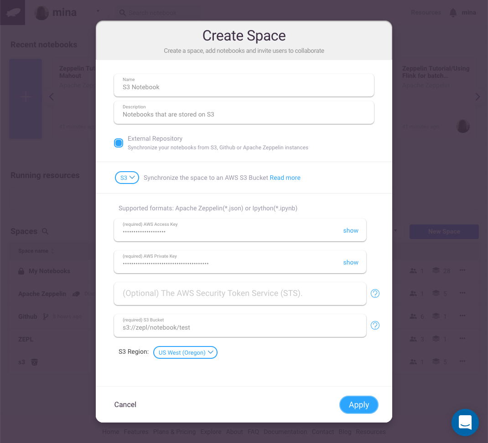
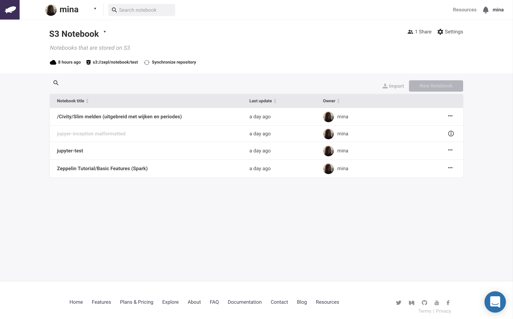

Integration with S3

In this section, we will explain how you can create an [Amazon Web Service](https://aws.amazon.com/) S3 Space in Zepl and seamlessly synchronize your notebooks from your own [**S3 Bucket**](https://aws.amazon.com/s3/).

# Create an AWS S3 Repository Space
Click on **New** from the navbar dropdown and select **Space**.
The first step is to choose the **type** of your space. Select the **Github** space **type** from the dropdown menu.

## Connecting to a S3 Repository
> In order for ZEPL to connect to your S3 repository, you will need to know your **Access key**, **Private key**, **Bucket** and **Region** for your S3 Bucket.
> If you are unaware of how to find and retrieve this information, you can refer the [AWS documentation](http://docs.aws.amazon.com/IAM/latest/UserGuide/introduction.html)

## Create S3 space in ZEPL
To create a new S3 space, select **Space** in the top of dropdown menu. A space dialog should appear.

Select **S3** in dropdown menu and then enter a name for your space and a short description.
Fill in the following fields with your AWS access keys and your S3 bucket name and region.

- AWS Access Key

- AWS Private Key 

- S3 Bucket name

- S3 Region 

A completed form should look like the following image.

If the synchronization is successful, the notebooks in your S3 bucket should be automatically added to your Zepl S3 Space.

The S3 space will automatically poll the AWS S3 Bucket every 10 mins for changes, update any modified notebooks, and remove any deleted notebooks. You can also manually retrigger the synchronization.
