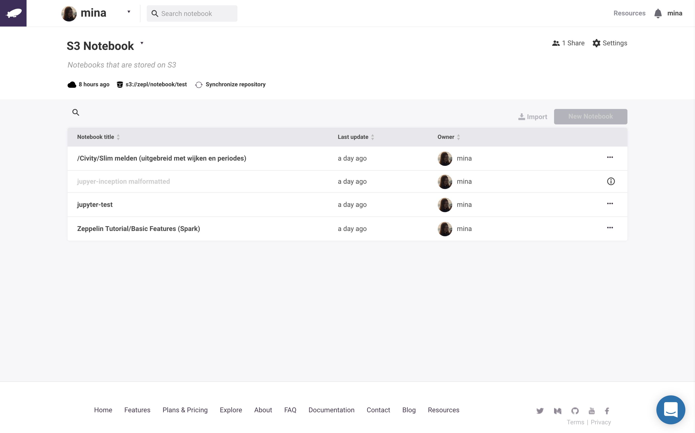

Integration with S3

In this section, we will explain how you can create a S3 of [Amazon Web Service](https://aws.amazon.com/) and seamlessly connect it with your [**S3**](https://aws.amazon.com/s3/).

 
## Requirement for connecting ZEPL
To create a new S3 in ZEPL, ZEPL needs **Access key**, **Private key**, **Bucket** and **Region** information in your S3. If you don't know those information, If you don't have those information, You can refer the [AWS documentation](http://docs.aws.amazon.com/IAM/latest/UserGuide/introduction.html).

 
## Create S3 space in ZEPL
To create a new S3 space, click **Space** in the top of dropdown menu then you can see **Space** windows.

Now, you have to click S3 in dropdown menu in space popup and then type a space name, short description and fill with your S3 information.

Then if you success to connect S3, ZEPL will show you **notebook list** which S3 have.

