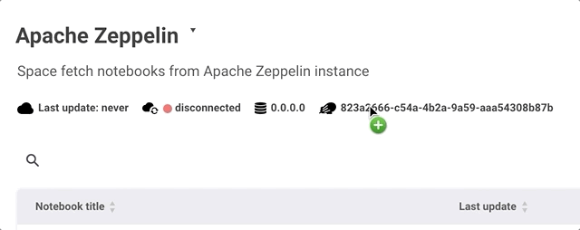

<span class="header-font">Integration with Apache Zeppelin</span>

In this section, we will explain how you can create a repository and seamlessly connect it with your **Apache Zeppelin**.

<br/>
# Hosted repository?
It is a repository provided from ZEPL by default.
You can find some tutorial notes in it to play around.


# Create a new Repository
To create a new repository, click **Repository** in the dropdown menu and type a repository name with short description for the new repository.


Then it will give you **a Unique Token** which will be used when you connect ZEPL with your Apache Zeppelin.
You can see the other properties of the repository. (e.g. IP and repository creation time)


To edit the repository information such as name & description or to delete it, open a dialog using **Edit repository** located in top-right corner of the page.


But be carefull. Deleting a repository means you no longer want to syncronize that repository with Apache Zeppelin.
So it will remove all notebook information included the repository from ZEPL.


<br/>
# Connect ZEPL with Apache Zeppelin

## Setting Apache Zeppelin environment variables

When you connect a repository to your ZEPL account, you need to set the following **environment variables** into your `ZEPPELIN_HOME/conf/zeppelin-env.sh` file.
If you don't have this file, you can create it from `ZEPPELIN_HOME/conf/zeppelin-env.sh.template`.

```
$ cd ZEPPELIN_HOME/conf
$ cp zeppelin-env.sh.template zeppelin-env.sh
```

After activating this configuration file,  add below three lines to `zeppelin-env.sh` file.
Don't forget to copy your **Token** generated before.



Below steps are little bit different according to your Apache Zeppelin version. So please check the version first.  

### (Deprecated) Zeppelin-0.5.X

First of all, you need a library for integration.
Please click this [download link](https://s3-ap-northeast-1.amazonaws.com/zeppel.in/zeppelinhub-integration-v0.4.0-all.jar) and copy it into `lib` directory under your ZEPPELIN_HOME (Apache Zeppelin installation directory).
If you don't have `lib` folder, just create a new one.


```sh
export ZEPPELIN_NOTEBOOK_STORAGE="org.apache.zeppelin.notebook.repo.VFSNotebookRepo, com.nflabs.zeppelinhub.notebook.repo.ZeppelinHubRepo"
export ZEPPELINHUB_API_ADDRESS="ADDRESS_OF_ZEPPELINHUB_SERVICE" (e.g. https://www.zepl.com)
export ZEPPELINHUB_API_TOKEN="YOUR_TOKEN_STRING"

# With user key if provided
export ZEPPELINHUB_USER_KEY="YOUR_USER_KEY"
```

<br/>
### Zeppelin-0.6.X

```sh
export ZEPPELIN_NOTEBOOK_STORAGE="org.apache.zeppelin.notebook.repo.VFSNotebookRepo, org.apache.zeppelin.notebook.repo.zeppelinhub.ZeppelinHubRepo"
export ZEPPELINHUB_API_ADDRESS="ADDRESS_OF_ZEPPELINHUB_SERVICE" (e.g. https://www.zepl.com)
export ZEPPELINHUB_API_TOKEN="YOUR_TOKEN_STRING"
```

<br/>
### Zeppelin-0.7.x single user

```sh
export ZEPPELIN_NOTEBOOK_STORAGE="org.apache.zeppelin.notebook.repo.GitNotebookRepo, org.apache.zeppelin.notebook.repo.zeppelinhub.ZeppelinHubRepo"
export ZEPPELINHUB_API_ADDRESS="ADDRESS_OF_ZEPPELINHUB_SERVICE" (e.g. https://www.zepl.com)
export ZEPPELINHUB_API_TOKEN="YOUR_TOKEN_STRING"
```
<br/>
### Zeppelin-0.7.x multiple users on Zeppelin server

```sh
export ZEPPELIN_NOTEBOOK_STORAGE="org.apache.zeppelin.notebook.repo.GitNotebookRepo, org.apache.zeppelin.notebook.repo.zeppelinhub.ZeppelinHubRepo"
export ZEPPELINHUB_API_ADDRESS="ADDRESS_OF_ZEPPELINHUB_SERVICE" (e.g. https://www.zepl.com)
```
As you can see, you don't need `ZEPPELINHUB_API_TOKEN` in this case, and you can utilize login with your ZEPL account, as described in the next section. In this case your token will be automatically recognized from your `repository` information and default one will be loaded. Note that if you're following this scenario, you'll need to complete the [next section](#login-to-apache-zeppelin-07x-with-zepl-credentials) as well in order to login with your ZEPL credentials.


You may also find up-to-date instructions on integrating latest Apache Zeppelin master branch with ZEPL on corresponding [Apache Zeppelin documentation website](https://zeppelin.apache.org/docs/0.7.0-SNAPSHOT/storage/storage.html#storage-in-zeppelinhub).

<br/>
## Login to Apache Zeppelin 0.7.x with ZEPL credentials
Starting from 0.7.x release Apache Zeppelin has added more multi-user support functionality, so we made it possible to login to Zeppelin with ZEPL credentials in case multiple users use same Zeppelin server. For better experience with integration we recommend you to use the latest release of `0.7.x` branch (e.g. `0.7.1`).

After you set the environment variables mentioned in [the previous section](#zeppelin-07x-multiple-users-on-zeppelin-server), first you'll need to modify your `conf/shiro.ini` security configuration file. If you don't have this file, you can create it from `ZEPPELIN_HOME/conf/shiro.ini.template`.

```
$ cd ZEPPELIN_HOME/conf
$ cp shiro.ini.template shiro.ini
```

Then you'll need to modify the section under `### A sample for configuring ZeppelinHub Realm` as below
```
### A sample for configuring ZeppelinHub Realm
zeppelinHubRealm = org.apache.zeppelin.realm.ZeppelinHubRealm

## Url of ZeppelinHub
zeppelinHubRealm.zeppelinhubUrl = service_url
securityManager.realms = $zeppelinHubRealm
```
note that instead of `service_url` you should have URL of your ZEPL service (e.g. https://www.zepl.com).

It completes this section by letting you login to Zeppelin with your ZEPL account credentials.

<br/>
## Start Apache Zeppelin daemon
<br/>
Finally, start (or restart) Apache Zeppelin.

```
$ cd ZEPPELIN_HOME
$ ./bin/zeppelin-daemon.sh start (or restart)
```

Then come back to ZEPL and check whether the green light is turned on or not.


<br/>
## Migrating Configurations
If you upgraded Zeppelin-0.5.X to later version, you need to change some configurations in Apache Zeppelin.

1\. Remove `zeppelinhub-integration-*.jar` file under `ZEPPELIN_HOME/lib/` directory.
```
$ rm ZEPPELIN_HOME/lib/zeppelinhub-integration-*.jar
```

2\. From your `Zeppelin-0.5.X` installation you should have the following variables already set in your `ZEPPELIN_HOME/conf/zeppelin-env.sh`.
```sh
export ZEPPELIN_NOTEBOOK_STORAGE="org.apache.zeppelin.notebook.repo.VFSNotebookRepo, com.nflabs.zeppelinhub.notebook.repo.ZeppelinHubRepo"
export ZEPPELINHUB_API_ADDRESS="ADDRESS_OF_ZEPPELINHUB_SERVICE" (e.g. https://www.zepl.com)
export ZEPPELINHUB_API_TOKEN="YOUR_TOKEN_STRING"

# With user key if provided
export ZEPPELINHUB_USER_KEY="YOUR_USER_KEY"
```

Starting from `Zeppelin-0.6.0` it is required that the second classname in `ZEPPELIN_NOTEBOOK_STORAGE` variable to be changed from `com.nflabs.zeppelinhub.notebook.repo.ZeppelinHubRepo` to `org.apache.zeppelin.notebook.repo.zeppelinhub.ZeppelinHubRepo`.
Thus you need to substitute

```sh
export ZEPPELIN_NOTEBOOK_STORAGE="org.apache.zeppelin.notebook.repo.VFSNotebookRepo, com.nflabs.zeppelinhub.notebook.repo.ZeppelinHubRepo"
```

with

```sh
export ZEPPELIN_NOTEBOOK_STORAGE="org.apache.zeppelin.notebook.repo.VFSNotebookRepo, org.apache.zeppelin.notebook.repo.zeppelinhub.ZeppelinHubRepo"
```
in your `ZEPPELIN_HOME/conf/zeppelin-env.sh`.


That's all. Then restart Zeppelin.

```
$ cd ZEPPELIN_HOME
$ ./bin/zeppelin-daemon.sh restart (or start)
```

Then come back to ZEPL and check whether the green light is turned on or not.


